# mRNA-EditFlow

mRNA-EditFlow frames mRNA design as a region-conditioned continuous-time edit
process. The central scientific question is:

**Can a single variable-length generator jointly edit 5'UTR, CDS and 3'UTR
while preserving CDS frame/protein identity and improving translation-relevant
sequence properties?**

The project hypothesis is that mRNA design is not just codon optimization and
not just UTR generation. It is a constrained edit process: CDS lives on a
frame-locked synonymous-codon lattice, while UTRs are free-length regulatory
canvases. This is the main architectural distinction from CDS-only optimizers,
5'UTR-only generators and representation-only mRNA language models.

## Algorithm Diagram

```mermaid
flowchart LR
    A[Public mRNA corpus<br/>GENCODE or RefSeq registry] --> B[Parse CDS coordinates]
    B --> C[Clean and validate<br/>T to U, ACGU only, AUG...stop]
    C --> D[Family-disjoint split<br/>MMseqs2 or MinHash fallback]
    C --> E[Feature precompute<br/>MFE, start accessibility, pairing propensity]
    D --> F[Hybrid coupling<br/>empty growth, corruption, ortholog]
    E --> F
    F --> G[Aligned z0,z1 via edit DP]
    G --> H[Sample CTMC bridge z_t]
    H --> I[Gap-free x_t plus region and phase tracks]
    I --> J[Frozen mRNA backbone]
    J --> K[MRNAEditFormer<br/>RoPE, region FiLM, codon constraints]
    K --> L[Rates and token distributions<br/>insert, substitute, delete]
    L --> M[Edit-Flow loss plus structure auxiliary loss]
    M --> N[Stage A full generator]
    N --> O[Stage B task adapters<br/>T2-T7]
```



## Core Model

At each nucleotide position `i`, the model predicts non-negative CTMC rates:

```text
(lambda_ins_i, lambda_sub_i, lambda_del_i) = softplus(h_theta(x_t, t, region, phase)_i)
```

and token distributions:

```text
p_ins_i(a) = softmax(g_ins(h_i))_a
p_sub_i(a) = softmax(g_sub(h_i))_a
```

The atomic transition intensities are:

```text
q(x -> Ins(x,i,a)) = lambda_ins_i * p_ins_i(a)
q(x -> Sub(x,i,a)) = lambda_sub_i * p_sub_i(a)
q(x -> Del(x,i))   = lambda_del_i
```

CDS substitutions are masked to synonymous nucleotides under the current codon.
CDS indels are either forbidden or restricted to codon-start whole-codon edits.
UTR edits remain nucleotide-level and variable-length.

Main complexities:

| Component | Complexity |
|---|---:|
| Levenshtein alignment | `O(len(x0) * len(x1))` per pair |
| Gap removal and target masks | `O(B * L)` |
| Transformer head | `O(B * layers * L^2 * dim)` |
| Fallback MFE proxy | `O(min(L, cap)^2)` |
| Pairing propensity | `O(L * window)` |
| MinHash family clustering | `O(N * L)` sketching plus candidate unions |

## Public Data

Training data must come from public, verifiable sources. The built-in registry
currently includes:

| Source | Public URL | Use | Integrity |
|---|---|---|---|
| GENCODE v45 protein-coding transcripts | https://ftp.ebi.ac.uk/pub/databases/gencode/Gencode_human/release_45/gencode.v45.pc_transcripts.fa.gz | Primary full-transcript corpus with `CDS:start-end` headers | SHA256 recorded in local manifest |
| NCBI RefSeq human RNA | https://ftp.ncbi.nlm.nih.gov/refseq/H_sapiens/mRNA_Prot/human.1.rna.gbff.gz | Public reference corpus with conservative plus-strand contiguous GenBank CDS parser | SHA256 recorded in local manifest |

Preprocessing includes:

| Requirement | Implementation |
|---|---|
| Completeness | Drop records without CDS coordinates or with out-of-range coordinates |
| Missing values | Require transcript id, 5'UTR, CDS, 3'UTR fields in canonical JSONL |
| Validity | ACGU alphabet only, `AUG` start, frame length, terminal stop, no internal stop |
| Standardization | Uppercase, strip whitespace, map DNA `T` to RNA `U` |
| Normalization | Cap 5'UTR/3'UTR lengths near CDS context; drop over-long CDS |
| Feature engineering | token ids, region ids, codon phases, MFE/accessibility/pairing features |
| Leakage control | family-disjoint train/val/test split through MMseqs2 or MinHash fallback |

Build cleaned public records:

```bash
cd /Users/bytedance/Documents/research
python3 -m mrna_editflow.data.public_pipeline \
  --download \
  --dataset gencode_human_transcripts \
  --data-dir /Users/bytedance/Documents/research/mrna_editflow/data/raw \
  --out-dir /Users/bytedance/Documents/research/mrna_editflow/data/processed \
  --seed 20260714
```

For a quick smoke build, add `--limit 512`.

RefSeq GenBank parser note: `refseq_human_rna` is supported by a conservative
stdlib parser for plus-strand contiguous `CDS` features. It skips complement,
remote, ambiguous multi-CDS and non-contiguous join records because those cannot
be represented as a single `5'UTR + CDS + 3'UTR` transcript without additional
feature modeling. Full RefSeq scale-up still requires downloading the official
`human.1.rna.gbff.gz`, writing the manifest, and auditing attrition counts.

## SOTA Landscape

This field does not have one universal leaderboard. Comparisons must be split by
task: full-transcript representation, CDS/codon generation, 5'UTR optimization,
and structure/codon dynamic programming.

| Method | Venue/year | Scope | Reported public signal | Accuracy/F1 | Speed/scale | MEF gap to close |
|---|---|---|---|---|---|---|
| LinearDesign | Nature 2023, https://doi.org/10.1038/s41586-023-06127-z | CDS structure plus codon optimization | Spike design in about 11 min; up to 128x antibody titer in mice | NA, design optimization | Strong DP baseline | Need compare CDS stability/CAI and biological proxy scores |
| EnsembleDesign | Bioinformatics 2025, https://doi.org/10.1093/bioinformatics/btaf245 | CDS ensemble free-energy optimization | Ensemble free-energy objective over codon lattice | NA | Lattice parsing | Need add structure-objective benchmark |
| mRNA-LM | NAR 2025, https://doi.org/10.1093/nar/gkaf044 | Full-length mRNA analysis | Integrated small LM over mRNA regions | Task dependent | Trained on millions of mRNAs | Need frozen-probe and adapter comparison |
| Helix-mRNA | arXiv 2025, https://arxiv.org/abs/2502.13785 | Full-length mRNA foundation model | Handles longer full mRNAs with fewer parameters than larger FMs | Task dependent | Long-context hybrid model | Need backbone adapter or embedding-cache comparison |
| codonGPT | NAR 2025, https://doi.org/10.1093/nar/gkaf1345 | CDS mRNA generation with RL | Trained on 338,417 mRNAs; optimizes expression/stability/GC rewards | NA, generative/RL | Scalable codon LM | Need beat CDS-only generation while adding UTR edits |
| CodonFM | NVIDIA open model 2025, https://developer.nvidia.com/blog/introducing-the-codonfm-open-model-for-rna-design-and-analysis/ | Codon-level RNA foundation encoder | Open codon-aware models announced at 80M/600M/1B parameter scales | Task dependent | RefSeq-scale codon FM | Need leakage-audited frozen-probe and adapter comparison |
| Prot2RNA | OpenReview 2026 submission, https://openreview.net/forum?id=BPNK5HDEMh | Protein-conditioned CDS diffusion | Codon-level accuracy and codon-usage profile claims | Codon accuracy reported by paper | Diffusion LM | Need protein-conditioned CDS benchmark and wet-lab proxy caution |
| GEMORNA | Science 2025, https://doi.org/10.1126/science.adr8470 | de novo full-length mRNA (enc-dec CDS + dec-only UTR, then combined) | Wet-lab: up to ~41x protein, ~128x antibody, ~121x circRNA in vivo | NA, generative | Zero-shot autoregressive decoders | Align T4 CDS-only + T5 UTR-only under one protocol; show MEF constrained-edit + 100% protein identity advantage vs modular regeneration |
| mRNA-GPT | ICLR 2026 submission, https://openreview.net/pdf?id=juUrI9kCBw | end-to-end full-length (decoder-only, joint 5'UTR+CDS+3'UTR) | Pretrained on 10M full-length mRNAs; beats LinearDesign/GEMORNA predicted translation rate; higher diversity | NA, generative | Decoder-only LM, iterative oracle optimization | Closest full-length rival: head-to-head full-length T1-T7, report TE delta AND hard-constraint satisfaction jointly |
| ProMORNA | arXiv 2026, https://arxiv.org/abs/2605.01513 | protein-conditioned full-length via multi-objective RL (BART + MO-GRPO) | 6M protein-mRNA pairs; improves half-life vs TE Pareto frontier on held-out luciferase | NA, multi-objective RL | GRPO, no wild-type template at inference | Adopt per-metric advantage standardization as a fusion route; align protein-conditioned CDS + multi-objective ranker to its Pareto frontier |
| RNAGenScape | ICML 2025 GenBio / arXiv 2025, https://arxiv.org/abs/2510.24736 | property-guided optimization + interpolation of existing mRNAs (manifold Langevin) | +148% median property gain, +30% success rate, on-manifold; robust at ~2000 points | NA, optimization | Latent Langevin, efficient inference | Benchmark MEF discrete constrained edit-flow vs its continuous latent trajectories; report constraint guarantees + edit-budget interpretability |
| UTailoR | iScience 2025, https://doi.org/10.1016/j.isci.2025.113544 | 5'UTR optimization | Optimized 5'UTRs reported around 200% TE improvement | Predictor dependent | 5'UTR generator | Need match TE proxy while preserving full transcript constraints |
| mRNA2vec | arXiv 2024, https://arxiv.org/abs/2408.09048 | 5'UTR-CDS representation | TE/EL/stability prediction improvements over UTR-LM/CodonBERT-style baselines | Regression metrics | Representation model | Need predictor baseline, not generation-only comparison |
| StructmRNA | Scientific Reports 2024, https://doi.org/10.1038/s41598-024-77172-5 | sequence-structure representation | RNA degradation and structure-aware representation | Task dependent | BERT-style | Need degradation/stability proxy benchmark |

Current local smoke benchmark in `benchmark/paper_table.md` is synthetic and is
only a plumbing check. It should not be claimed as SOTA evidence. Paper-grade
claims require at least 10 seeds, public-data splits, external baselines and
paired/bootstrap significance tests.

Regenerate the measured SOTA gap report after each benchmark refresh:

```bash
cd /Users/bytedance/Documents/research
python3 -m mrna_editflow.eval.sota_gap_report \
  --project-root /Users/bytedance/Documents/research/mrna_editflow \
  --out-json docs/sota_gap_report.json \
  --out-md docs/sota_gap_report.md
```

Current generated SOTA artifacts:

- JSON: `docs/sota_gap_report.json`
- Markdown: `docs/sota_gap_report.md`

External SOTA dry-run readiness:

```bash
cd /Users/bytedance/Documents/research
PYTHONPATH=/Users/bytedance/Documents/research \
python3 -m mrna_editflow.baselines.external_sota_dry_run \
  --out-dir /Users/bytedance/Documents/research/mrna_editflow/benchmark/external_sota/dry_run_t5_head1024 \
  --task-id T5 \
  --records-jsonl /Users/bytedance/Documents/research/mrna_editflow/benchmark/multiseed_t5_public_head1024_sources.jsonl \
  --limit 1024 \
  --split-name public_head1024 \
  --seed 0 \
  --hardware-label local_or_remote_benchmark_host \
  --models LinearDesign EnsembleDesign codonGPT Prot2RNA UTailoR UTRGAN
```

Generated dry-run artifacts:

- `benchmark/external_sota/dry_run_t5_head1024/summary.json`
- `benchmark/external_sota/dry_run_t5_head1024/runtime.json`
- `benchmark/external_sota/dry_run_t5_head1024/table.md`

Current server dry-run status:

| External method | Status | Required setup before real metrics | Fair comparison scope |
|---|---|---|---|
| LinearDesign | `measured_head1024` | Official adapter complete; protocol-faithful lambda sweep still pending | CDS/protein-conditioned codon-lattice objective; not full UTR editing |
| EnsembleDesign | `running_head1024_budgeted` | Finish resumable 1024-row run; paper-default 200/30/20 remains pending | CDS ensemble-free-energy objective under synonymous codon constraints |
| codonGPT | `measured_head1024_pretrained_checkpoint` | Official HF checkpoint complete; paper RL policies remain unavailable | CDS synonymous constrained generation; pretrained checkpoint result is not RL reproduction |
| Prot2RNA | `not_configured` | `PROT2RNA_BIN` or `prot2rna` on PATH | Protein-conditioned CDS generation; no UTR editing |
| UTailoR | `measured_strict_315` | Official 25--100 nt subset complete; license absent from archive | 5'UTR optimization on its official input domain while MEF preserves CDS/3'UTR |
| UTRGAN | `measured_head1024_paper_default` | Paper-default 10000-step run complete; retain 10-step result as a separate budgeted ablation | 5'UTR generation under the same fixed CDS/3'UTR contract |

This dry-run is an audit artifact, not a performance comparison. Do not claim
external SOTA TE, accuracy/F1, runtime or stability metrics until the row is
`executable_ready` and a real adapter writes measured outputs under
`benchmark/external_sota/` with dataset hash, split, seed, record count,
hardware and runtime. As of the latest server dry-run, `summary.json` and
`table.md` also include `candidate_audit` for each model; `*_BIN` variables must
point to a real executable file (or the command must resolve on `PATH`), so a
stale placeholder path is kept as `not_configured` rather than upgraded to
`executable_ready`.

Audit adapter-written real outputs before reporting any external metric:

```bash
PYTHONPATH=/Users/bytedance/Documents/research \
python3 -m mrna_editflow.eval.audit_external_sota_real_runs \
  --project-root /Users/bytedance/Documents/research/mrna_editflow \
  --out-json docs/external_sota_real_run_audit.json \
  --out-md docs/external_sota_real_run_audit.md
```

Reproduce the official budgeted UTRGAN run, constrained UTR-only ceiling, and
T5 report refresh on the server:

```bash
ROOT=/home/cunyuliu/mrna_editflow_goal/mrna_editflow \
UTRGAN_GPU=2 UTRGAN_STEPS=10 LOCAL_WORKERS=16 \
bash /home/cunyuliu/mrna_editflow_goal/mrna_editflow/scripts/run_external_utrgan_head1024.sh
```

Run the paper-default 10000-step UTRGAN protocol without overwriting the
budgeted 10-step artifact:

```bash
ROOT=/home/cunyuliu/mrna_editflow_goal/mrna_editflow \
UTRGAN_GPU=4 \
bash /home/cunyuliu/mrna_editflow_goal/mrna_editflow/scripts/run_external_utrgan_paper10000.sh
```

Run the actual MEF UTR-specific model with a hard 5'UTR-only candidate canvas:

```bash
ROOT=/home/cunyuliu/mrna_editflow_goal/mrna_editflow \
SHARDED=1 SHARD_GPUS="0 2" \
bash /home/cunyuliu/mrna_editflow_goal/mrna_editflow/scripts/run_mef_utr5only_head1024.sh
```

This runner evaluates seeds `0..4` and `5..9` on separate GPUs, merges the
shards, verifies `editable_regions=["utr5"]`, and refreshes the T5/readiness
reports. It is the model-only descriptive arm; it does not make UTRGAN's
unconditional outputs source-conditioned, so paired inference remains closed.

Run official UTailoR and the matched-transcript MEF hard-budget-5 arm:

```bash
ROOT=/home/cunyuliu/mrna_editflow_goal/mrna_editflow \
bash /home/cunyuliu/mrna_editflow_goal/mrna_editflow/scripts/run_external_utailor_head1024.sh

ROOT=/home/cunyuliu/mrna_editflow_goal/mrna_editflow \
SHARD_GPUS="0 2" \
bash /home/cunyuliu/mrna_editflow_goal/mrna_editflow/scripts/run_mef_utailor_subset_budget5.sh
```

Set up and run the official public codonGPT pretrained checkpoint:

```bash
ROOT=/home/cunyuliu/mrna_editflow_goal/mrna_editflow \
bash /home/cunyuliu/mrna_editflow_goal/mrna_editflow/scripts/setup_external_codongpt.sh

ROOT=/home/cunyuliu/mrna_editflow_goal/mrna_editflow \
CODONGPT_GPU=6 BATCH_SIZE=64 RESUME=1 \
bash /home/cunyuliu/mrna_editflow_goal/mrna_editflow/scripts/run_external_codongpt_head1024.sh
```

This pins HF revision `ee7017c4bdd285206b87be2e65a28272ff4ac88e`
and weights SHA-256 `df41546883e31ba13598d5ae74044666502a89ba34630d6f6c32943836e6f454`.
It reproduces the model-card synonymous-mask generation path, not the paper's
unreleased task-specific RL policies.

Current head1024 evidence:

- LinearDesign: `1024/1024`, zero failures, valid CDS and exact protein
  fractions `1.0`, mean CAI `0.78466`, mean MFE `-517.08926`, and
  `78.62445 s/sequence`. This is a single-lambda run, not the full paper sweep.
- UTRGAN 10-step budgeted run: `1024/1024`, zero failures, proxy TE delta
  `+0.02872`, mean UTR edit distance `70.99805`, normalized edit distance
  `0.62633`, and fixed CDS/3'UTR/protein fractions `1.0`.
- UTRGAN paper-default 10000-step run: `1024/1024`, zero failures, proxy TE
  delta `+0.04068`, mean UTR edit distance `72.48535`, normalized edit
  distance `0.63032`, mean length delta `+8.08887`, and fixed
  CDS/3'UTR/protein fractions `1.0`. Relative to the 10-step batch, proxy TE
  delta increases by `+0.01196`; this is an ordered-batch descriptive
  comparison, not paired source-conditioned inference.
- Constrained UTR-only oracle-guided ceiling: proxy TE delta `+0.08302`,
  mean edit distance `2.93750`, and fixed CDS/3'UTR/protein plus budget
  fractions `1.0`.
- MEF UTR-specific adapter under the hard 5'UTR-only canvas: 10-seed
  head1024 proxy TE delta `-0.00478`, seed-bootstrap 95% CI
  `[-0.00515, -0.00442]`, paired sign-flip `p=0.00450`, i.e. a significant
  negative result. CDS/3'UTR/protein/frame/budget fractions remain `1.0`.
- Pure UTR-teacher checkpoint on the same hard canvas: proxy TE delta
  `+0.00318`, 95% CI `[+0.00266, +0.00365]`, `p=0.00450`.
- Full-then-UTR sequential checkpoint: `+0.00298`, 95% CI
  `[+0.00270, +0.00326]`, `p=0.00450`. Both teacher checkpoints significantly
  beat the region adapter (`+0.00796` and `+0.00775`, both `p=0.00450`), while
  pure vs sequential is not significant (`+0.00021`, `p=0.56772`).
- UTailoR official 25--100 nt subset: `315/315`, proxy TE delta `+0.036105`,
  mean edit distance `4.41905`, TE/edit `0.008170`, and all fixed-region/protein
  constraints `1.0`.
- MEF pure UTR teacher, hard budget 5 on those exact 315 records: 10-seed TE
  delta `+0.007774`, 95% CI `[+0.006834,+0.008805]`, `p=0.00450`, mean edit
  distance `4.79619`, TE/edit `0.001621`, and all hard constraints `1.0`.
  MEF minus UTailoR is `-0.028332`, 95% CI `[-0.029271,-0.027301]`,
  `p=0.00450`. This is still not an exact budget match because UTailoR has no
  per-record hard edit cap.
- codonGPT official pretrained checkpoint: `1024/1024`, zero failures, valid
  CDS and exact protein fractions `1.0`. The 10-seed aggregate has codon
  accuracy `0.42030`, CAI `0.70449`, GC `0.56475`, and GC3 `0.66242`.
  CAI delta vs native is `+0.01079`, 95% CI `[+0.00912,+0.01239]`,
  sign-flip `p=0.00450`. This is measured pretrained synonymous-mask
  generation, not the paper's unreleased RL policy or an expression claim.

The T5 descriptive table is
`docs/t5_external_utr_baseline_comparison.{json,md}`. It does not permit a
model-only or SOTA superiority claim because local search directly optimizes
the shared oracle and UTRGAN is not source-conditioned. The paper-default
10000-step protocol is complete, but that only opens its protocol-fidelity
gate. Numerically, the best MEF 5'UTR-only model (`+0.00318`) trails both
budgeted UTRGAN (`+0.02872`) and paper-default UTRGAN (`+0.04068`), as well as
the oracle-guided local-search ceiling (`+0.08302`).

Executable CDS-only lattice baseline:

```bash
cd /Users/bytedance/Documents/research
python3 -m mrna_editflow.baselines.codon_lattice_dp \
  --records-jsonl /Users/bytedance/Documents/research/mrna_editflow/data/processed/gencode_human_transcripts.records.jsonl \
  --out-jsonl /Users/bytedance/Documents/research/mrna_editflow/benchmark/codon_lattice_dp_head256.records.jsonl \
  --out-json /Users/bytedance/Documents/research/mrna_editflow/benchmark/codon_lattice_dp_head256.json \
  --limit 256 \
  --max-codon-changes 3 \
  --target-gc 0.55 \
  --cai-weight 1.0 \
  --gc-weight 0.10 \
  --boundary-weight 0.05
```

This baseline is a transparent synonymous-codon dynamic program over the CDS
lattice. It preserves protein identity exactly and reports CAI/GC deltas. It is
a local executable slice for comparing against LinearDesign/EnsembleDesign-style
codon-lattice optimizers; it is not a substitute for running those external
tools.

Current public head256 DP result (`benchmark/codon_lattice_dp_head256.json`):

| Metric | Source | DP optimized | Delta |
|---|---:|---:|---:|
| mean CAI | 0.67322 | 0.70004 | +0.02682 |
| mean CDS GC | 0.61309 | 0.61954 | +0.00645 |
| protein identity fraction | 1.0000 | 1.0000 | 0.0000 |

The run used `--max-codon-changes 3`, so it is intentionally a conservative
CDS-only optimization slice.

Executable UTR-only predictor-guided local-search baseline:

```bash
ssh cunyuliu@36.137.135.49
PYTHONPATH=/home/cunyuliu/mrna_editflow_goal \
/home/cunyuliu/miniconda3/envs/editflow/bin/python3.10 \
  -m mrna_editflow.baselines.utr_local_search \
  --records-jsonl /home/cunyuliu/mrna_editflow_goal/mrna_editflow/benchmark/multiseed_t5_public_head256_ranker_full1k_top32/sources.jsonl \
  --out-jsonl /home/cunyuliu/mrna_editflow_goal/mrna_editflow/benchmark/utr_local_search_head256.records.jsonl \
  --out-json /home/cunyuliu/mrna_editflow_goal/mrna_editflow/benchmark/utr_local_search_head256.json \
  --limit 256 \
  --workers 16 \
  --edit-budget 3 \
  --beam-width 16 \
  --max-length-delta 6 \
  --start-window-nt 90 \
  --max-edit-positions 90
```

This baseline is an executable Optimus/UTailoR-style comparator: it maximizes
the independent local TE oracle over 5'UTR edit operations while preserving the
CDS and 3'UTR exactly. For source UTR `x` and candidate `y`, it optimizes
`F(y)=TE_oracle(y,c)-alpha(GC(y)-g*)^2-beta*uAUG(y)` under
`d_edit(x,y)<=K`. Beam search over selected start-proximal and motif positions
has complexity `O(K * B * P * Q)`, where `K` is edit budget, `B` is beam width,
`P` is selected edit positions and `Q` is oracle feature cost.

Current public head256 UTR-search result
(`benchmark/utr_local_search_head256.json`):

| Metric | Source | UTR search | Delta |
|---|---:|---:|---:|
| mean oracle TE | 0.77984 | 0.86725 | +0.08741 |
| mean oracle MRL | 8.30103 | 9.01184 | +0.71080 |
| mean edit distance | - | 2.94141 | - |
| mean length delta | - | +0.46875 | - |
| CDS unchanged fraction | 1.0000 | 1.0000 | 0.0000 |
| 3'UTR unchanged fraction | 1.0000 | 1.0000 | 0.0000 |

This result is a strong UTR-only oracle-guided baseline, not a model-only MEF
claim. It quantifies a remaining target for the edit-flow ranker: current MEF
head256 ranker improves TE by `+0.00560` over its matched baseline, while local
UTR predictor-guided search can reach `+0.08741` on the same 256-source slice.

Ranker-compatible UTR one-step teacher export:

```bash
ssh cunyuliu@36.137.135.49
PYTHONPATH=/home/cunyuliu/mrna_editflow_goal \
/home/cunyuliu/miniconda3/envs/editflow/bin/python3.10 \
  -m mrna_editflow.baselines.utr_teacher_export \
  --records-jsonl /home/cunyuliu/mrna_editflow_goal/mrna_editflow/benchmark/multiseed_t5_public_head256_ranker_full1k_top32/sources.jsonl \
  --out-jsonl /home/cunyuliu/mrna_editflow_goal/mrna_editflow/benchmark/utr_teacher_head256.jsonl \
  --out-json /home/cunyuliu/mrna_editflow_goal/mrna_editflow/benchmark/utr_teacher_head256.json \
  --limit 256 \
  --candidate-cap 256 \
  --max-length-delta 1 \
  --start-window-nt 90 \
  --max-edit-positions 90
```

This exports one-step rows directly consumable by `train_proposal_ranker.py`.
For source transcript `x` and one-step 5'UTR proposal `y`, each row uses
`teacher_score = TE_oracle(y)-TE_oracle(x)`. Candidate capping keeps both high
and low teacher-score extremes, preserving Bradley-Terry pairwise contrast for
ranker distillation.

Current public head256 teacher export
(`benchmark/utr_teacher_head256.json`):

| Metric | Value |
|---|---:|
| records | 256 |
| records with one-step rows | 250 |
| teacher rows | 59,768 |
| mean best one-step TE | 0.82835 |
| mean source TE | 0.77838 |
| mean best one-step delta TE | +0.04997 |
| mean worst one-step delta TE | -0.09721 |
| max teacher score | +0.20865 |
| min teacher score | -0.19462 |

UTR-teacher ranker fine-tune command:

```bash
ssh cunyuliu@36.137.135.49
CUDA_VISIBLE_DEVICES=0 \
PYTHONPATH=/home/cunyuliu/mrna_editflow_goal \
/home/cunyuliu/miniconda3/envs/editflow/bin/python3.10 \
  -m mrna_editflow.train_proposal_ranker \
  --records-jsonl /home/cunyuliu/mrna_editflow_goal/mrna_editflow/benchmark/multiseed_t5_public_head256_ranker_full1k_top32/sources.jsonl \
  --teacher-jsonl /home/cunyuliu/mrna_editflow_goal/mrna_editflow/benchmark/utr_teacher_head256.jsonl \
  --base-checkpoint /home/cunyuliu/mrna_editflow_goal/mrna_editflow/ckpts/stage_a_public_full_1k_bs8ga4/stage_a_best_for_proposal_ranker.pt \
  --save-dir /home/cunyuliu/mrna_editflow_goal/mrna_editflow/ckpts/proposal_ranker_t5_utr_teacher_head256 \
  --profile-path /home/cunyuliu/mrna_editflow_goal/mrna_editflow/logs/proposal_ranker_t5_utr_teacher_head256.profile.jsonl \
  --steps 500 \
  --batch-records 4 \
  --max-pairs-per-record 64 \
  --lr 2e-5 \
  --device cuda
```

Smoke training evidence:

- 20-step remote smoke completed on the head256 teacher JSONL.
- Checkpoint:
  `/home/cunyuliu/mrna_editflow_goal/mrna_editflow/ckpts/proposal_ranker_t5_utr_teacher_head256_smoke/proposal_ranker_best.pt`
- Profile:
  `logs/proposal_ranker_t5_utr_teacher_head256_smoke.profile.jsonl`
- Best loss: `0.04979`; final step loss: `0.10488`; usable transcripts:
  `250`; final step pair count: `64`; throughput: `10.32 records/s`.

Full UTR-teacher ranker fine-tune evidence:

- 500-step remote fine-tune completed on the same head256 teacher JSONL.
- Checkpoint:
  `/home/cunyuliu/mrna_editflow_goal/mrna_editflow/ckpts/proposal_ranker_t5_utr_teacher_head256/proposal_ranker_best.pt`
- Profile:
  `/home/cunyuliu/mrna_editflow_goal/mrna_editflow/logs/proposal_ranker_t5_utr_teacher_head256.profile.jsonl`
- Best loss: `0.00040`; final step loss: `0.00527`; usable transcripts:
  `250`; final step pair count: `256`; throughput: `9.10 records/s`.

Multi-objective reward head (roadmap architecture upgrade #1):

`mrna_editflow.baselines.multiobjective_teacher_export` labels each legal
one-step 5'UTR edit with a *vector* of "higher-is-better" objective deltas
(`te`, `mrl`, `cai`, `gc`, `access`, `uaug`) instead of a single TE delta. Each
objective is min-max normalized within a transcript's candidate pool and emitted
as `source_scores`. Three fusions are computed for every candidate:

- **Ranking fusion** (`scalar_fused_score`): the weighted scalarization
  `fuse(y)=sum_k w_k * norm_k(delta_k(y))`.
- **Pareto fusion** (`pareto_fused_score`): an explicit **fast non-dominated
  sort** (NSGA-II ranking) over the objective-delta vectors. `a` dominates `b`
  when it is no worse on every objective and strictly better on at least one.
  Each row carries its `pareto_rank` (front `0` is the non-dominated set) and
  `pareto_front_size`; `pareto_fused_score` puts fronts into disjoint bands in
  `[0,1]` (better fronts strictly outrank worse ones, scalarization breaks ties
  inside a band) so it can drive ranking directly and recovers concave Pareto
  regions that pure scalarization misses.
- **GRPO-standardized fusion** (`grpo_fused_score`): follows ProMORNA's MO-GRPO
  — each objective's raw delta (advantage) is z-scored across the candidate pool
  *before* weighted aggregation. Unlike min-max scalarization this is
  scale-invariant per objective, so a large-magnitude metric cannot dominate the
  fusion purely because of its units/variance (a real number, can be negative).

`MultiObjectiveConfig(fusion_mode=...)` (CLI `--fusion-mode`) selects which
fusion populates `teacher_score`: `scalar` (default, backward compatible),
`pareto`, or `grpo_standardized`. All modes always emit every fused score
(`scalar_fused_score`, `pareto_fused_score`, `grpo_fused_score`) plus the full
Pareto metadata for audit. The rows are directly consumable by
`train_proposal_ranker.py`:

- `--pair-source-mode source_balanced` applies a Bradley-Terry loss
  independently per objective (Pareto-front-preserving: each objective keeps its
  own ordering, no single global collapse).
- `--pair-source-mode global` uses the fused `teacher_score`.

```bash
ssh cunyuliu@36.137.135.49
CUDA_VISIBLE_DEVICES='' \
PYTHONPATH=/home/cunyuliu/mrna_editflow_goal \
/home/cunyuliu/miniconda3/envs/editflow/bin/python3.10 \
  -m mrna_editflow.baselines.multiobjective_teacher_export \
  --records-jsonl /home/cunyuliu/mrna_editflow_goal/mrna_editflow/data/processed/gencode_human_transcripts.records.jsonl \
  --out-jsonl /home/cunyuliu/mrna_editflow_goal/mrna_editflow/benchmark/multiobjective_teacher_headN.jsonl \
  --out-json /home/cunyuliu/mrna_editflow_goal/mrna_editflow/benchmark/multiobjective_teacher_headN.json \
  --limit 256 --candidate-cap 256 --fusion-mode pareto
```

End-to-end validation evidence (remote CPU smoke on the in-progress 10k Stage A
checkpoint):

- head8 multi-objective export wrote 144 rows across 6 transcripts; all six
  objective columns are present.
- A 15-step `source_balanced` ranker smoke over that teacher produced
  independent per-objective Bradley-Terry pairs
  (`pair_source_counts={te,mrl,gc,access,uaug}`) with finite loss decreasing
  monotonically (`1.78 -> 1.58 -> 0.56`), and saved `proposal_ranker_best.pt`.
- Boundary noted honestly: because these are UTR-only edits, the `cai` objective
  delta is `0.0` (the CDS is never mutated), so `cai` contributes no ranking
  pairs in the UTR-only regime; it becomes active only under CDS-editing tasks
  (T4), which is the intended scope for that objective.

Region-specialized adapters (roadmap architecture upgrade #2):

`mrna_editflow.models.region_adapters.RegionSpecializedEditFormer` wraps a base
`MRNAEditFormer` and inserts a per-region residual adapter between the shared
trunk (`base.encode`) and the output heads (`base.heads`):
`h'_i = h_i + A_{r(i)}(h_i)`, where `r(i)` is the region label at position `i`
and each `A_r` is a bottleneck MLP `D -> b -> D` with a zero-initialized output
layer. This gives the 5'UTR regulatory canvas, the CDS coding lattice and the
3'UTR stability canvas their own lightweight heads instead of forcing one shared
ranker to encode all three objectives.

Key properties (all covered by `tests/test_region_adapters.py`):

- Identity at init: zero-init adapters make the wrapper reproduce the base model
  exactly, so a 10k Stage A checkpoint loads into `base` and behaves identically
  until adapters are trained.
- Checkpoint-safe: the base `state_dict` is untouched (adapters live under
  `adapters.*`), verified by a `strict=True` reload into a fresh base model.
- Region gating: perturbing only the CDS adapter changes CDS positions while
  non-CDS positions stay bit-for-bit identical (residual identity); BOS/PAD
  sentinels bypass all adapters.
- Frozen-base training: with `freeze_base=True` only `2*D*b + D + b` params per
  region are trainable and gradients flow solely to the adapters.

This required a behavior-preserving refactor of `MRNAEditFormer.forward` into
`encode()` (trunk) + `heads()` (constraint-masked outputs); all 13
training/sampling smoke tests still pass, confirming the split is exact.

The region adapters now also have a Stage B training entry point:
`python3 -m mrna_editflow.train_adapter --adapter-kind region`. This path reuses
the same edit-flow loss as Stage A/Stage B, freezes the backbone and base
`MRNAEditFormer`, and audits that only `adapters.*` parameters are trainable and
changed. `--regions 5utr,cds,3utr` may be narrowed to a single region for the
planned UTR/CDS/3'UTR teacher-distillation ablations.

For the full ablation scaffold, use
`scripts/run_region_adapter_ablation.sh --dry-run`. It is slice-parameterized
(`SLICE=head256/head1024`) and plans `utr5`, `cds`, `utr3` and `all` region
adapter checkpoints under `ckpts/region_adapter_t5_<mode>_<slice>`.

Protein-conditioned CDS design (roadmap architecture upgrade #3):

`mrna_editflow.baselines.protein_conditioned_cds` upgrades T4 from *editing an
existing CDS* to *designing a CDS from a target protein*. Given amino-acid
string `p`, it builds a deterministic valid seed CDS
`x0 = AUG + c(a_1) + ... + c(a_n) + stop` (a Met initiator is prepended and
flagged if `p` does not start with `M`), then co-optimizes CAI/GC over the
synonymous lattice with the audited `optimize_cds_synonymous` DP, which provably
keeps `translate()` invariant. Protein identity is therefore a hard constraint,
never traded off, and is independently re-verified per design.

```bash
# Design CDS for the target proteins implied by a public split's CDS.
python3 -m mrna_editflow.baselines.protein_conditioned_cds \
  --records-jsonl /home/cunyuliu/mrna_editflow_goal/mrna_editflow/data/processed/gencode_human_transcripts.records.jsonl \
  --out-jsonl /home/cunyuliu/mrna_editflow_goal/mrna_editflow/benchmark/protein_conditioned_cds_headN.jsonl \
  --out-json /home/cunyuliu/mrna_editflow_goal/mrna_editflow/benchmark/protein_conditioned_cds_headN.json \
  --limit 256 --target-gc 0.55 --cai-weight 1.0 --gc-weight 0.10
```

Local evidence (30-residue target, `tests/test_protein_conditioned_cds.py`):
protein identity `1.0`, valid designed CDS, CAI improved `0.8464 -> 0.9032`
(+0.0568) via 17 synonymous codon changes. All 5 unit tests assert exact
protein identity, in-frame validity, and CAI non-regression versus the seed.

Frozen-backbone adapter comparison (roadmap architecture upgrade #4):

`mrna_editflow.eval.frozen_backbone_comparison` compares frozen mRNA
foundation-model encoders under the Edit-Flow head *fairly*, with two hard
guarantees:

- **Leakage gate.** Before any comparison it audits the evaluation split against
  a reference/pretraining-corpus proxy with `data.leakage_audit.audit_leakage`.
  If anything is flagged and `require_gate=True` (default), the fair-comparison
  claim is *refused* and no training arms run (`skipped_reason` is recorded), so
  memorisation can never inflate a frozen-encoder number.
- **Matched budget.** Every backbone is trained under the *same* `MEFConfig`
  head with identical steps/seed/records via `train_stage_a`; only the frozen
  encoder changes. The trainable-parameter budget is therefore identical by
  construction, and each arm records its `trainable_params` to prove it.

Honesty contract: offline, the external foundation models resolve to
deterministic placeholder encoders (`FrozenBackbone.is_real == False`). Those
arms are tagged `valid_quality_signal=False` and their loss reflects
matched-budget pipeline plumbing only, **never** a real foundation model's
downstream quality; the only genuine trainable-quality arm is the from-scratch
`none` encoder (`is_real=True`). No SOTA metric is ever fabricated for a stub.
Real integration is a single seam (`FrozenBackbone._try_load_pretrained`): drop
a real checkpoint there, run on a leakage-free split, and the numbers become
quotable.

```bash
# Leakage-gated, matched-budget comparison over a public eval split.
python3 -m mrna_editflow.eval.frozen_backbone_comparison \
  --query-jsonl /home/cunyuliu/mrna_editflow_goal/mrna_editflow/data/processed/gencode_human_test.records.jsonl \
  --reference-jsonl /home/cunyuliu/mrna_editflow_goal/mrna_editflow/data/processed/gencode_human_train.records.jsonl \
  --backbones none helix_mrna mrnabert lamar \
  --steps 200 --hidden-dim 256 --device cuda \
  --out-json /home/cunyuliu/mrna_editflow_goal/mrna_editflow/benchmark/frozen_backbone_comparison.json \
  --out-md /home/cunyuliu/mrna_editflow_goal/mrna_editflow/benchmark/frozen_backbone_comparison.md \
  --leakage-json /home/cunyuliu/mrna_editflow_goal/mrna_editflow/benchmark/frozen_backbone_leakage.json
```

`--backbones` accepts any registered name (`none`, `mrnabert`, `helix_mrna`,
`orthrus`, `orthrus_mlm`, `lamar`, `rna_fm`, `rinalmo`); adding CodonFM means
registering its name and loader in `models/backbones.py` first.

Offline unit evidence (`tests/test_frozen_backbone_comparison.py`, 9 tests):
matched trainable-parameter budget across arms, real-vs-stub tagging, finite
loss, and all four gate paths (skipped when no reference, passed on disjoint
corpora, failed+refused on self-overlap, diagnostic when `require_gate=False`),
plus JSON+Markdown report emission.

Head64 proposal-ranking audit with the same full legal T5 proposal pool
(`limit=64`, `candidate_cap=0`, `top_k=32`):

| Model | mean model regret | oracle-best in model top-32 | mean model-top TE |
|---|---:|---:|---:|
| Stage A base | 0.03812 | 0.03279 | 0.78953 |
| Previous TE-ranker | 0.02985 | 0.42623 | 0.79779 |
| UTR-teacher ranker | 0.03212 | 0.70492 | 0.79552 |
| Direct hybrid teacher | 0.03156 | 0.47541 | 0.79608 |
| Full-then-UTR sequential | **0.02798** | 0.40984 | **0.79967** |
| Source-aware hybrid | 0.03088 | **0.75410** | 0.79676 |
| Cascade hard-negative v2 | **0.02526** | 0.73770 | **0.80238** |

The UTR-teacher ranker strongly improves top-32 recall of oracle-best edits,
which is useful for downstream reranking/search. Its top-1 regret is still
slightly weaker than the previous TE-ranker, so the next training target is a
hybrid teacher that combines full-pool TE ranking with UTR local-search
extremes.

Hybrid teacher follow-up:

- Direct hybrid teacher JSONL:
  `/home/cunyuliu/mrna_editflow_goal/mrna_editflow/benchmark/hybrid_teacher_head256.jsonl`
- Direct hybrid teacher summary:
  128,586 rows, 253 records, 26,881 overlap rows between full-pool and UTR
  teachers, mean best teacher score `+0.04937`.
- Direct hybrid training from Stage A did not dominate both teachers: it improved
  over base but landed between previous TE-ranker and UTR-teacher ranker.
- Sequential fine-tune from the previous full-pool TE-ranker onto UTR-teacher
  rows achieved the best current top-1 regret (`0.02798`) and mean model-top TE
  (`0.79967`), but did not improve top-32 oracle-best recall over the previous
  ranker. The next architecture/training step should make pair sampling
  source-aware so full-pool precision and UTR-search recall are optimized as
  separate objectives instead of competing through one global extreme-pair
  sampler.
- Source-aware hybrid training implements that split with
  `--pair-source-mode source_balanced`, producing balanced final-step pair
  counts (`full=128`, `utr=128`). It achieves the best current top-32 recall
  (`0.75410`) while keeping regret below the Stage A base. The remaining gap is
  to combine this recall with the sequential ranker's best top-1 regret.
- Cascade hard-negative v2 mines cascade win/loss transcripts into a new
  source-balanced teacher (`cascade_rescue` and `cascade_precision` labels),
  then fine-tunes from the source-aware hybrid checkpoint. It achieves the best
  current head64 proposal-regret (`0.02526`) and mean model-top TE (`0.80238`)
  while preserving near-source-aware top-32 recall (`0.73770`). This is now the
  priority checkpoint for direct decoding and larger-slice validation.

Two-stage cascade audit:

```bash
ssh cunyuliu@36.137.135.49
CUDA_VISIBLE_DEVICES=0 \
PYTHONPATH=/home/cunyuliu/mrna_editflow_goal \
/home/cunyuliu/miniconda3/envs/editflow/bin/python3.10 \
  -m mrna_editflow.eval.cascade_proposal_ranking \
  --records-jsonl /home/cunyuliu/mrna_editflow_goal/mrna_editflow/benchmark/multiseed_t5_public_head256_ranker_full1k_top32/sources.jsonl \
  --recall-checkpoint /home/cunyuliu/mrna_editflow_goal/mrna_editflow/ckpts/proposal_ranker_t5_sourceaware_hybrid_teacher_head256/proposal_ranker_best.pt \
  --precision-checkpoint /home/cunyuliu/mrna_editflow_goal/mrna_editflow/ckpts/proposal_ranker_t5_full1k_then_utr_teacher_head256/proposal_ranker_best.pt \
  --out-json /home/cunyuliu/mrna_editflow_goal/mrna_editflow/benchmark/cascade_sourceaware_to_sequential_head64_k64.json \
  --task-id T5 \
  --limit 64 \
  --device cuda \
  --candidate-cap 0 \
  --recall-top-k 64
```

| Cascade | recall top-k | mean cascade regret | oracle-best retained | mean cascade top TE |
|---|---:|---:|---:|---:|
| Source-aware recall -> sequential precision | 32 | 0.02970 | 0.75410 | 0.79794 |
| Source-aware recall -> sequential precision | 64 | **0.02788** | **0.80328** | **0.79976** |
| Source-aware recall -> hard-negative v2 precision | 64 | **0.02664** | **0.80328** | **0.80100** |

The `k=64` cascade slightly improves top-1 regret over the sequential full-pool
ranker (`0.02788` vs `0.02798`) while keeping substantially higher oracle-best
recall. This makes the current best practical decoding recipe:
source-aware hybrid for candidate recall, then sequential/full-pool ranker for
precision reranking.

After hard-negative v2 training, the precision ranker full-pool audit is even
stronger than the source-aware top-64 cascade (`0.02526` full-pool regret versus
`0.02664` cascade regret). This means recall truncation is now the bottleneck:
hard-negative v2 direct top64 is now the default decoding setting. The completed
top128 ablation underperformed top64, so the next search step should improve
recall quality or evaluate larger recall top-k rather than simply widening
direct stochastic sampling.

Cascade decoding smoke benchmark:

```bash
ssh cunyuliu@36.137.135.49
CUDA_VISIBLE_DEVICES=0 \
PYTHONPATH=/home/cunyuliu/mrna_editflow_goal \
/home/cunyuliu/miniconda3/envs/editflow/bin/python3.10 \
  -m mrna_editflow.eval.run_multiseed_benchmark \
  --records-jsonl /home/cunyuliu/mrna_editflow_goal/mrna_editflow/benchmark/multiseed_t5_public_head256_ranker_full1k_top32/sources.jsonl \
  --checkpoint /home/cunyuliu/mrna_editflow_goal/mrna_editflow/ckpts/proposal_ranker_t5_full1k_then_utr_teacher_head256/proposal_ranker_best.pt \
  --cascade-recall-checkpoint /home/cunyuliu/mrna_editflow_goal/mrna_editflow/ckpts/proposal_ranker_t5_sourceaware_hybrid_teacher_head256/proposal_ranker_best.pt \
  --out-dir /home/cunyuliu/mrna_editflow_goal/mrna_editflow/benchmark/multiseed_t5_cascade_sourceaware_seq_smoke16 \
  --task-id T5 \
  --seeds 0 1 2 3 4 \
  --limit 16 \
  --edit-budget 3 \
  --device cuda \
  --proposal-top-k 64 \
  --cascade-recall-top-k 64 \
  --proposal-temperature 1.0 \
  --n-bootstrap 200 \
  --max-pairwise-pairs 32 \
  --max-novelty-sources 32 \
  --resume
```

Smoke result (`benchmark/multiseed_t5_cascade_sourceaware_seq_smoke16`):

| Metric | Mean | Bootstrap low | Bootstrap high | Seeds | Records |
|---|---:|---:|---:|---:|---:|
| delta oracle TE vs source | +0.00820 | +0.00412 | +0.01379 | 5 | 16 |
| mean oracle TE | 0.77123 | 0.76715 | 0.77682 | 5 | 16 |

This is an engineering gate showing that cascade decoding now works through the
same multi-seed generation/evaluation stack. The completed claim-grade version
below uses the full head256 slice, 10 seeds, exact novelty
(`--max-novelty-sources 0`) and the same paired comparison guard as the earlier
ranker experiments.

Claim-grade cascade decoding benchmark:

```bash
ssh cunyuliu@36.137.135.49
cd /home/cunyuliu/mrna_editflow_goal/mrna_editflow
PY=/home/cunyuliu/miniconda3/envs/editflow/bin/python3.10
RECORDS=/home/cunyuliu/mrna_editflow_goal/mrna_editflow/benchmark/multiseed_t5_public_head256_ranker_full1k_top32/sources.jsonl
PRECISION=/home/cunyuliu/mrna_editflow_goal/mrna_editflow/ckpts/proposal_ranker_t5_full1k_then_utr_teacher_head256/proposal_ranker_best.pt
RECALL=/home/cunyuliu/mrna_editflow_goal/mrna_editflow/ckpts/proposal_ranker_t5_sourceaware_hybrid_teacher_head256/proposal_ranker_best.pt

CUDA_VISIBLE_DEVICES=0 PYTHONPATH=/home/cunyuliu/mrna_editflow_goal \
$PY -m mrna_editflow.eval.run_multiseed_benchmark \
  --records-jsonl "$RECORDS" \
  --checkpoint "$PRECISION" \
  --out-dir /home/cunyuliu/mrna_editflow_goal/mrna_editflow/benchmark/multiseed_t5_public_head256_seq_full_then_utr_top64 \
  --task-id T5 \
  --seeds 0 1 2 3 4 5 6 7 8 9 \
  --edit-budget 3 \
  --device cuda \
  --proposal-top-k 64 \
  --proposal-temperature 1.0 \
  --n-bootstrap 1000 \
  --max-pairwise-pairs 64 \
  --max-novelty-sources 0 \
  --resume

CUDA_VISIBLE_DEVICES=0 PYTHONPATH=/home/cunyuliu/mrna_editflow_goal \
$PY -m mrna_editflow.eval.run_multiseed_benchmark \
  --records-jsonl "$RECORDS" \
  --checkpoint "$PRECISION" \
  --cascade-recall-checkpoint "$RECALL" \
  --out-dir /home/cunyuliu/mrna_editflow_goal/mrna_editflow/benchmark/multiseed_t5_public_head256_cascade_sourceaware_seq_top64 \
  --task-id T5 \
  --seeds 0 1 2 3 4 5 6 7 8 9 \
  --edit-budget 3 \
  --device cuda \
  --proposal-top-k 64 \
  --cascade-recall-top-k 64 \
  --proposal-temperature 1.0 \
  --n-bootstrap 1000 \
  --max-pairwise-pairs 64 \
  --max-novelty-sources 0 \
  --resume

PYTHONPATH=/home/cunyuliu/mrna_editflow_goal \
$PY -m mrna_editflow.eval.compare_benchmarks \
  --baseline sequential_top64=/home/cunyuliu/mrna_editflow_goal/mrna_editflow/benchmark/multiseed_t5_public_head256_seq_full_then_utr_top64/multiseed_summary.json \
  --run cascade_top64=/home/cunyuliu/mrna_editflow_goal/mrna_editflow/benchmark/multiseed_t5_public_head256_cascade_sourceaware_seq_top64/multiseed_summary.json \
  --out-json /home/cunyuliu/mrna_editflow_goal/mrna_editflow/benchmark/compare_t5_head256_cascade_vs_seq_top64.json \
  --out-md /home/cunyuliu/mrna_editflow_goal/mrna_editflow/benchmark/compare_t5_head256_cascade_vs_seq_top64.md \
  --metrics mean_oracle_te delta_oracle_te_vs_source legal_fraction within_budget_fraction mean_protein_identity reading_frame_intact_fraction kmer_js codon_usage_kl mean_novelty exact_source_match_fraction \
  --require-default-matching-config \
  --n-bootstrap 1000 \
  --n-permutations 2000
```

Formal head256 result:

| Decoder | Records | Seeds | effective top-k | delta oracle TE vs source | mean oracle TE | mean novelty | Constraint safety |
|---|---:|---:|---:|---:|---:|---:|---|
| Sequential precision only | 256 | 10 | 64 | +0.00391 `[0.00338, 0.00448]` | 0.78374 `[0.78321, 0.78432]` | 0.00322 | legal=1.0, protein=1.0, budget=1.0, frame=1.0 |
| Source-aware recall -> sequential precision | 256 | 10 | 64 | **+0.00482** `[0.00419, 0.00548]` | **0.78466** `[0.78402, 0.78531]` | **0.00325** | legal=1.0, protein=1.0, budget=1.0, frame=1.0 |
| Hard-negative v2 direct precision | 256 | 10 | 64 | **+0.00503** `[0.00447, 0.00575]` | **0.78486** `[0.78431, 0.78559]` | **0.00327** | legal=1.0, protein=1.0, budget=1.0, frame=1.0 |

Paired comparison versus sequential top64
(`benchmark/compare_t5_head256_hardneg_v2_top64`):

| Metric | Sequential | Cascade | Hard-negative v2 | Hard-negative paired delta | 95% CI(delta) | paired p |
|---|---:|---:|---:|---:|---:|---:|
| delta oracle TE vs source | 0.00391 | 0.00482 | 0.00503 | +0.00112 | `[0.00041, 0.00180]` | 0.02049 |
| mean oracle TE | 0.78374 | 0.78466 | 0.78486 | +0.00112 | `[0.00041, 0.00180]` | 0.02049 |
| mean novelty | 0.00322 | 0.00325 | 0.00327 | +0.00005 | `[0.00004, 0.00007]` | 0.00450 |

Interpretation: cascade decoding gives a small positive TE trend at matched
effective top-k, but the TE paired test is not below 0.05. Hard-negative v2
direct top64 is stronger: it improves `delta_oracle_te_vs_source` over the
sequential top64 baseline with paired `p=0.02049` while preserving all hard
biological constraints. Against cascade top64, hard-negative v2 is slightly
higher in mean TE (`+0.00021`) but not significant (`p=0.75262`), so the
current paper-safe claim is significant improvement over sequential precision
and parity/slight mean gain versus cascade.

Search-width ablation confirms that wider is not automatically better for this
ranker: hard-negative v2 top128 drops below top64
(`delta_oracle_te_vs_source` `0.00368` vs `0.00503`, paired delta `-0.00134`,
`p=0.00450`) while constraints remain intact. Therefore the current default
paper setting is hard-negative v2 direct top64, not top128. The next decoding
work should improve recall quality rather than simply widening stochastic
sampling.

Head1024 scale-up validation keeps the same conclusion under a 4x larger record
slice:

| Decoder | Records | Seeds | delta oracle TE vs source | mean oracle TE | Constraint safety |
|---|---:|---:|---:|---:|---|
| Sequential precision top64 | 1024 | 10 | +0.00239 `[0.00210, 0.00269]` | 0.79342 `[0.79313, 0.79373]` | legal=1.0, protein=1.0, budget=1.0, frame=1.0 |
| Hard-negative v2 direct top64 | 1024 | 10 | **+0.00385** `[0.00360, 0.00414]` | **0.79489** `[0.79464, 0.79518]` | legal=1.0, protein=1.0, budget=1.0, frame=1.0 |

Paired head1024 comparison
(`benchmark/compare_t5_head1024_hardneg_v2_top64`) gives TE delta `+0.00147`,
95% CI `[0.00114, 0.00179]`, paired `p=0.00450`. This makes hard-negative v2
top64 the current strongest model-only decoding setting across both head256 and
head1024.

Per-record error analysis (`benchmark/cascade_error_analysis_head256_top64`)
turns this trend into a v2 training recipe: cascade wins most strongly on low
source-TE transcripts (`source_te_bin=low`, mean gain `+0.00404`) and transcripts
with upstream AUGs (`source_uaug_presence=1`, mean gain `+0.00474`), but loses on
some high source-TE or no-uAUG cases. The next source-aware teacher should mine
cascade wins as UTR-rescue positives and cascade losses as precision-preserving
hard negatives.

Frozen-backbone leakage audit before foundation-model comparisons:

```bash
cd /Users/bytedance/Documents/research
python3 -m mrna_editflow.data.leakage_audit \
  --query-jsonl /Users/bytedance/Documents/research/mrna_editflow/benchmark/multiseed_t5_public_head256_ranker_full1k_top32/sources.jsonl \
  --reference-jsonl /Users/bytedance/Documents/research/mrna_editflow/data/processed/gencode_human_transcripts.records.jsonl \
  --out-json /Users/bytedance/Documents/research/mrna_editflow/benchmark/leakage_ranker_head256_vs_gencode.json \
  --out-md /Users/bytedance/Documents/research/mrna_editflow/benchmark/leakage_ranker_head256_vs_gencode.md \
  --kmer 15 \
  --top-k 3 \
  --jaccard-threshold 0.80 \
  --containment-threshold 0.95
```

This reports exact sequence matches, k-mer Jaccard and containment nearest
neighbours. The containment score is included because truncated isoforms can be
high-leakage even when raw Jaccard is moderate.

## Environment

Minimum Python dependencies:

```bash
cd /Users/bytedance/Documents/research/mrna_editflow
python3 -m venv .venv
. .venv/bin/activate
pip install -r requirements.txt
```

Recommended optional tools:

| Tool | Purpose |
|---|---|
| MMseqs2 | stronger family-disjoint clustering |
| ViennaRNA Python package or `RNAfold` binary | higher-fidelity structural features |
| CUDA PyTorch | Stage A/B scale-up training |

Local note: the current macOS system Python in this workspace does not have
`numpy` or `torch`, so full tests require the virtual environment above.

## Reproducible Training

Stage A generator smoke run:

```bash
cd /Users/bytedance/Documents/research
python3 -m mrna_editflow.train_backbone \
  --records-jsonl /Users/bytedance/Documents/research/mrna_editflow/data/processed/gencode_human_transcripts.records.jsonl \
  --steps 1000 \
  --save-dir /Users/bytedance/Documents/research/mrna_editflow/ckpts/stage_a \
  --profile-path /Users/bytedance/Documents/research/mrna_editflow/benchmark/stage_a_profile.jsonl \
  --seed 20260714 \
  --device cuda
```

Stage B adapter run:

```bash
cd /Users/bytedance/Documents/research
python3 -m mrna_editflow.train_adapter \
  --records-jsonl /Users/bytedance/Documents/research/mrna_editflow/data/processed/gencode_human_transcripts.records.jsonl \
  --base-checkpoint /Users/bytedance/Documents/research/mrna_editflow/ckpts/stage_a/stage_a_best.pt \
  --task-id T5 \
  --steps 1000 \
  --save-dir /Users/bytedance/Documents/research/mrna_editflow/ckpts/stage_b_t5 \
  --profile-path /Users/bytedance/Documents/research/mrna_editflow/benchmark/stage_b_t5_profile.jsonl \
  --seed 20260714 \
  --device cuda
```

Generate model-guided candidate records from a Stage A checkpoint:

```bash
cd /Users/bytedance/Documents/research
python3 -m mrna_editflow.sample \
  --records-jsonl /Users/bytedance/Documents/research/mrna_editflow/data/processed/gencode_human_transcripts.records.jsonl \
  --checkpoint /Users/bytedance/Documents/research/mrna_editflow/ckpts/stage_a/stage_a_best.pt \
  --task-id T5 \
  --edit-budget 3 \
  --proposal-top-k 0 \
  --proposal-temperature 0.0 \
  --guidance-scale 50.0 \
  --limit 256 \
  --device cuda \
  --output-jsonl /Users/bytedance/Documents/research/mrna_editflow/benchmark/generated_t5_candidates.jsonl
```

Set `--proposal-top-k 0` for a full legal-proposal oracle-guided ablation; this
setting produced the strongest current T5 TE proxy result while preserving all
hard constraints. The default `8` keeps decoding closer to the model's
highest-rate local edits and should be reported as a separate model-only
baseline.

Offline evaluation:

```bash
cd /Users/bytedance/Documents/research
python3 -m mrna_editflow.eval.run_eval \
  --candidates /Users/bytedance/Documents/research/mrna_editflow/benchmark/generated_t5_candidates.jsonl \
  --sources /Users/bytedance/Documents/research/mrna_editflow/data/processed/gencode_human_transcripts.records.jsonl \
  --task-id all \
  --out-dir /Users/bytedance/Documents/research/mrna_editflow/benchmark/public_eval \
  --seeds 0 1 2 3 4 5 6 7 8 9 \
  --n-bootstrap 2000
```

For large public corpora, `pairwise_diversity` is exact while
`N(N-1)/2 <= 64` by default; above that it uses deterministic uniform pair
subsampling and reports `pairwise_diversity_exact`, `pairwise_pairs_total`, and
`pairwise_pairs_evaluated` in `eval_summary.json`. Use
`--max-pairwise-pairs` to raise or lower that cap. Novelty against sources keeps
exact semantics by default through exact-match lookup and length lower-bound
pruning. Exploratory large runs may set `--max-novelty-sources K` to evaluate
only the K closest-length sources per candidate; such runs are deterministic but
approximate and report `novelty_exact=false`.

Paper-style multi-seed benchmark:

```bash
cd /Users/bytedance/Documents/research
python3 -m mrna_editflow.eval.run_multiseed_benchmark \
  --records-jsonl /Users/bytedance/Documents/research/mrna_editflow/data/processed/gencode_human_transcripts.records.jsonl \
  --checkpoint /Users/bytedance/Documents/research/mrna_editflow/ckpts/stage_a/stage_a_best.pt \
  --task-id T5 \
  --edit-budget 3 \
  --proposal-top-k 0 \
  --proposal-temperature 0.0 \
  --guidance-scale 50.0 \
  --limit 256 \
  --device cuda \
  --seeds 0 1 2 3 4 5 6 7 8 9 \
  --n-bootstrap 2000 \
  --max-novelty-sources 0 \
  --resume \
  --out-dir /Users/bytedance/Documents/research/mrna_editflow/benchmark/multiseed_t5_public
```

`--resume` reuses a seed only when both `seed_NNN/candidates.jsonl` and
`seed_NNN/eval_summary.json` are present and parseable. Every long run appends
events to `multiseed_progress.jsonl` (`seed_start`, `seed_candidates_written`,
`seed_evaluated`, `seed_resumed`, `benchmark_complete`), giving the recovery
logic an auditable trace without changing completed seed metrics.

Compare decoding/guidance variants against a model-only baseline:

```bash
cd /Users/bytedance/Documents/research
python3 -m mrna_editflow.eval.compare_benchmarks \
  --baseline unguided=/Users/bytedance/Documents/research/mrna_editflow/benchmark/multiseed_t5_public_head32_stochastic/multiseed_summary.json \
  --run top32_te_guided=/Users/bytedance/Documents/research/mrna_editflow/benchmark/multiseed_t5_public_head32_guided_te_g10_k32/multiseed_summary.json \
  --run all_proposal_te_guided=/Users/bytedance/Documents/research/mrna_editflow/benchmark/multiseed_t5_public_head32_guided_te_g50_all_10seed/multiseed_summary.json \
  --out-json /Users/bytedance/Documents/research/mrna_editflow/benchmark/t5_guidance_comparison.json \
  --out-md /Users/bytedance/Documents/research/mrna_editflow/benchmark/t5_guidance_comparison.md \
  --metrics mean_oracle_te delta_oracle_te_vs_source mean_protein_identity within_budget_fraction mean_edit_distance
```

Current generated comparison artifacts:

- JSON: `benchmark/t5_guidance_comparison.json`
- Markdown: `benchmark/t5_guidance_comparison.md`

| Variant | N records | Seeds | `delta_oracle_te_vs_source` | Paired delta vs unguided | paired p | Constraint safety |
|---|---:|---:|---:|---:|---:|---|
| unguided model proposals | 32 | 10 | -0.00016 | baseline | - | protein=1.0, budget=1.0 |
| top-32 TE rerank | 32 | 10 | -0.00013 | +0.00003 | 0.84458 | protein=1.0, budget=1.0 |
| all-legal-proposal TE rerank | 32 | 10 | +0.06930 | +0.06946 | 0.00450 | protein=1.0, budget=1.0 |

Interpretation: the all-legal-proposal run is an oracle-guided upper-bound
ablation over the same constraint-safe edit budget. It proves that the edit
operators contain high-TE reachable neighbors, while the small top-32 gain shows
that the current 20-step model checkpoint does not yet rank those neighbors
strongly enough. The next model-scale milestone is to close this ranking gap
with longer Stage A/B training and TE-aware reward conditioning.

Server launch pattern:

```bash
ssh cunyuliu@36.137.135.49 -p 22
cd /path/to/research
python3 -m venv .venv
. .venv/bin/activate
pip install -r mrna_editflow/requirements.txt
python3 -m mrna_editflow.data.public_pipeline --download --dataset gencode_human_transcripts --data-dir mrna_editflow/data/raw --out-dir mrna_editflow/data/processed
python3 -m mrna_editflow.train_backbone --records-jsonl mrna_editflow/data/processed/gencode_human_transcripts.records.jsonl --steps 10000 --device cuda
```

Current full-corpus scale-up entry point:

- Public corpus: GENCODE v45 protein-coding transcripts, 111,048 raw records,
  54,680 cleaned records after CDS/frame/alphabet validation and UTR truncation.
- Config: `configs/stage_a_full_bs8_gradaccum4.json`, using `batch_size=8`
  and `grad_accum=4` to keep the effective batch near 32 while fitting
  full-length batches on a 40GB A100.
- Remote run directory: `ckpts/stage_a_public_full_1k_bs8ga4`, with profile
  logs in `logs/stage_a_public_full_1k_bs8ga4.profile.jsonl`.

```bash
CUDA_VISIBLE_DEVICES=4 PYTHONPATH=/home/cunyuliu/mrna_editflow_goal \
/home/cunyuliu/miniconda3/envs/editflow/bin/python3.10 \
  -m mrna_editflow.train_backbone \
  --config /home/cunyuliu/mrna_editflow_goal/mrna_editflow/configs/stage_a_full_bs8_gradaccum4.json \
  --records-jsonl /home/cunyuliu/mrna_editflow_goal/mrna_editflow/data/processed/gencode_human_transcripts.records.jsonl \
  --steps 1000 \
  --save-dir /home/cunyuliu/mrna_editflow_goal/mrna_editflow/ckpts/stage_a_public_full_1k_bs8ga4 \
  --profile-path /home/cunyuliu/mrna_editflow_goal/mrna_editflow/logs/stage_a_public_full_1k_bs8ga4.profile.jsonl \
  --device cuda \
  --seed 0
```

Guarded Stage A 10k scale-up launcher:

```bash
ssh cunyuliu@36.137.135.49 -p 22
cd /home/cunyuliu/mrna_editflow_goal/mrna_editflow

# Inspect the exact command, paths and metadata targets without starting GPU work.
./scripts/run_stage_a_scaleup_10k.sh --dry-run

# Launch only after a target GPU has at least MIN_FREE_MEM_MB free memory.
nohup ./scripts/run_stage_a_scaleup_10k.sh \
  > /home/cunyuliu/mrna_editflow_goal/mrna_editflow/logs/stage_a_public_full_10k_bs8ga4_seed0.launch.log 2>&1 &
```

The launcher writes `logs/stage_a_public_full_10k_bs8ga4_seed0.metadata.json`
before training. That metadata records dataset SHA256, split name, seed, record
count, step count, selected GPU, checkpoint directory, profile path, host name
and hardware platform. By default it refuses to overwrite an existing
checkpoint/profile/log and exits if the selected GPU has less than 20 GB free
memory. Use `RUN_NAME`, `CUDA_VISIBLE_DEVICES`, `MIN_FREE_MEM_MB` and
`ALLOW_EXISTING=1` only when intentionally changing the run identity or guard.

Current 10k scale-up run:

- Launched on remote GPU6 with `RUN_NAME=stage_a_public_full_10k_bs8ga4_seed0`.
- PIDs at launch: launcher `4037207`, script `4037208`, `train_backbone`
  `4037283`.
- Metadata:
  `logs/stage_a_public_full_10k_bs8ga4_seed0.metadata.json`; it records
  `steps=10000`, `seed=0`, `record_count=54680`, `CUDA_VISIBLE_DEVICES=6` and
  dataset SHA256
  `5a74b0ea8d40065fd44383625ab17a4b4bc6e33b7185b67056edda7ecb7448d3`.
- Stability checks reached profile step `2280` with finite loss,
  `oom_reductions=0`, and an initial `stage_a_best.pt` checkpoint present.

Post-10k watcher:

```bash
nohup ./scripts/run_after_stage_a_10k.sh \
  > /home/cunyuliu/mrna_editflow_goal/mrna_editflow/logs/run_after_stage_a_10k.log 2>&1 &
```

This waits for `train_backbone` PID `4037283`, freezes
`stage_a_best_10k_final_for_proposal_ranker.pt`, exports a head1024
proposal-ranking teacher, writes a matched base head64 audit, trains a 500-step
proposal ranker and writes a matched ranker head64 audit.

Current watcher PIDs: launcher `1418093`, waiting script `1418094`.
The generated 10k artifacts will be picked up automatically by
`eval/sota_gap_report.py` once they exist:
`proposal_ranking_t5_stage_a10k_head1024.json`,
`proposal_ranking_t5_base_stage_a10k_head64.json` and
`proposal_ranking_t5_ranker_stage_a10k_head64.json`.

After a checkpoint is available, audit whether the model ranks high-TE legal
neighbours near the top of its own proposal list:

```bash
PYTHONPATH=/home/cunyuliu/mrna_editflow_goal \
/home/cunyuliu/miniconda3/envs/editflow/bin/python3.10 \
  -m mrna_editflow.eval.proposal_ranking \
  --records-jsonl /home/cunyuliu/mrna_editflow_goal/mrna_editflow/data/processed/gencode_human_transcripts.records.jsonl \
  --checkpoint /home/cunyuliu/mrna_editflow_goal/mrna_editflow/ckpts/stage_a_public_full_1k_bs8ga4/stage_a_best.pt \
  --task-id T5 \
  --limit 256 \
  --candidate-cap 0 \
  --top-k 32 \
  --device cuda \
  --out-json /home/cunyuliu/mrna_editflow_goal/mrna_editflow/benchmark/proposal_ranking_t5_full1k.json \
  --out-jsonl /home/cunyuliu/mrna_editflow_goal/mrna_editflow/benchmark/proposal_ranking_t5_full1k.candidates.jsonl
```

Long-running server automation:

```bash
# Resume-safe fair head256 baseline-vs-ranker comparison. It reuses completed
# seed_NNN/eval_summary.json files, writes progress JSONL, then regenerates the
# paired comparison and SOTA gap report.
nohup /home/cunyuliu/mrna_editflow_goal/mrna_editflow/scripts/run_head256_ranker_fair_eval.sh \
  > /home/cunyuliu/mrna_editflow_goal/mrna_editflow/logs/run_head256_ranker_fair_eval.log 2>&1 &

# Refresh docs/sota_gap_report.{json,md} once the strict head256 ranker
# comparison finishes.
nohup /home/cunyuliu/mrna_editflow_goal/mrna_editflow/scripts/watch_head256_refresh_sota.sh \
  > /home/cunyuliu/mrna_editflow_goal/mrna_editflow/logs/watch_head256_refresh_sota.log 2>&1 &

# After Stage A exits, freeze the final best checkpoint, rerun the 256-record
# full-pool teacher audit, train a final TE-ranker, and audit the final ranker
# on the same head64 proposal-ranking slice.
nohup /home/cunyuliu/mrna_editflow_goal/mrna_editflow/scripts/run_after_stage_a_full1k.sh \
  > /home/cunyuliu/mrna_editflow_goal/mrna_editflow/logs/run_after_stage_a_full1k.log 2>&1 &
```

Both scripts support `--dry-run` and only start GPU work after their guarded
condition is satisfied.

For long full-pool audits, recover interim metrics directly from the candidate
JSONL:

```bash
PYTHONPATH=/home/cunyuliu/mrna_editflow_goal \
/home/cunyuliu/miniconda3/envs/editflow/bin/python3.10 \
  -m mrna_editflow.eval.summarize_proposal_ranking \
  --jsonl /home/cunyuliu/mrna_editflow_goal/mrna_editflow/benchmark/proposal_ranking_t5_full1k.candidates.jsonl \
  --top-k 32 \
  --out-json /home/cunyuliu/mrna_editflow_goal/mrna_editflow/benchmark/proposal_ranking_t5_full1k_interim.json
```

The audit reports ``mean_model_regret = TE(oracle-best legal proposal) -
TE(model-top proposal)`` and ``oracle_best_in_model_top_k_fraction``. Its JSONL
rows expose ``teacher_score = TE(candidate)-TE(source)`` and
``student_score = log(model_score)``, which are ready for a pairwise TE-ranking
distillation loss in the next Stage B/RL-style fine-tuning pass.

Use that teacher file to fine-tune the proposal ranking field:

```bash
cp /home/cunyuliu/mrna_editflow_goal/mrna_editflow/ckpts/stage_a_public_full_1k_bs8ga4/stage_a_best.pt \
  /home/cunyuliu/mrna_editflow_goal/mrna_editflow/ckpts/stage_a_public_full_1k_bs8ga4/stage_a_best_for_proposal_ranker.pt
PYTHONPATH=/home/cunyuliu/mrna_editflow_goal \
/home/cunyuliu/miniconda3/envs/editflow/bin/python3.10 \
  -m mrna_editflow.train_proposal_ranker \
  --records-jsonl /home/cunyuliu/mrna_editflow_goal/mrna_editflow/data/processed/gencode_human_transcripts.records.jsonl \
  --teacher-jsonl /home/cunyuliu/mrna_editflow_goal/mrna_editflow/benchmark/proposal_ranking_t5_full1k.candidates.jsonl \
  --base-checkpoint /home/cunyuliu/mrna_editflow_goal/mrna_editflow/ckpts/stage_a_public_full_1k_bs8ga4/stage_a_best_for_proposal_ranker.pt \
  --save-dir /home/cunyuliu/mrna_editflow_goal/mrna_editflow/ckpts/proposal_ranker_t5_full1k \
  --profile-path /home/cunyuliu/mrna_editflow_goal/mrna_editflow/logs/proposal_ranker_t5_full1k.profile.jsonl \
  --steps 500 \
  --batch-records 4 \
  --max-pairs-per-record 32 \
  --lr 2e-5 \
  --device cuda \
  --seed 0
```

This minimises a Bradley-Terry pairwise loss
``softplus(-sign(delta_TE) * delta_model / tau)`` over candidates from the same
source transcript. It is a training-time distillation signal; final claims still
come from held-out multi-seed benchmarks and paired significance tests.

Current TE-ranking distillation evidence:

- Teacher audit, 256 records/full legal proposal pool:
  `benchmark/proposal_ranking_t5_full1k_final.json`.
- Matched head64 proposal audit:
  `benchmark/proposal_ranking_t5_base_full1k_head64.json` versus
  `benchmark/proposal_ranking_t5_ranker_full1k_final_head64.json`.
- Fair 10-seed decoding comparisons:
  `benchmark/t5_ranker_comparison.json`, `benchmark/t5_ranker_comparison.md`,
  `benchmark/t5_ranker_full1k_head256_comparison.json`, and
  `benchmark/t5_ranker_full1k_head256_comparison.md`.

| Evidence | Base snapshot | TE-ranker | Delta |
|---|---:|---:|---:|
| Head64 mean model regret, lower is better | 0.03812 | 0.02985 | -0.00827 |
| Head64 oracle-best-in-model-top32 fraction | 0.03279 | 0.42623 | +0.39344 |
| Head32 10-seed `delta_oracle_te_vs_source` | -0.00526 | +0.00520 | +0.01046 |
| Head32 10-seed `mean_oracle_te` | 0.79951 | 0.80997 | +0.01046 |
| Head256 10-seed `delta_oracle_te_vs_source` | -0.00154 | +0.00406 | +0.00560 |
| Head256 10-seed `mean_oracle_te` | 0.77830 | 0.78390 | +0.00560 |

The ranker comparison is generated with a config guard so the paired test fails
when nuisance variables diverge between baseline and candidate runs. Prefer
`--require-default-matching-config` for new paper tables: it checks `task_id`,
`edit_budget`, `proposal_temperature`, `n_records`, `seeds`,
`target_length_delta`, guidance targets, pairwise/novelty evaluation caps, and
`effective_proposal_top_k`. For ordinary single-ranker decoding,
`effective_proposal_top_k = proposal_top_k`; for cascade decoding,
`effective_proposal_top_k = cascade_recall_top_k`, so cascade-vs-single-ranker
claims are only paired when their retained candidate widths are matched.

```bash
cd /Users/bytedance/Documents/research
python3 -m mrna_editflow.eval.compare_benchmarks \
  --baseline base_full1k_top32=/Users/bytedance/Documents/research/mrna_editflow/benchmark/multiseed_t5_public_head32_base_full1k_top32/multiseed_summary.json \
  --run ranker_full1k_top32=/Users/bytedance/Documents/research/mrna_editflow/benchmark/multiseed_t5_public_head32_ranker_full1k_top32/multiseed_summary.json \
  --out-json /Users/bytedance/Documents/research/mrna_editflow/benchmark/t5_ranker_comparison.json \
  --out-md /Users/bytedance/Documents/research/mrna_editflow/benchmark/t5_ranker_comparison.md \
  --metrics mean_oracle_te delta_oracle_te_vs_source mean_protein_identity within_budget_fraction mean_edit_distance \
  --n-bootstrap 500 \
  --n-permutations 2000 \
  --require-default-matching-config
```

The fair head256 paired result is `+0.00560` in
`delta_oracle_te_vs_source`, 95% CI `[0.00470, 0.00660]`, paired
permutation `p = 0.00450`, while preserving `mean_protein_identity = 1.0`
and `within_budget_fraction = 1.0`. This converts the previous 32-record
closure into a stricter 256-record signal. The next paper-grade gate is
cross-dataset validation against executable external mRNA design baselines and
foundation-encoder transfer with leakage audits.

For paper-grade training, run 10 seeds, log the exact manifest SHA256, and
report mean, 95% bootstrap CI and paired significance against every baseline.

## Scale-Up Plan

1. Data scale: start with GENCODE v45, add RefSeq through the conservative
   GenBank CDS parser plus full manifest audit, and add MPRA/TE/stability
   datasets for oracle training.
2. Model scale: benchmark `none`, mRNA-native, Helix-mRNA, mRNA-LM style and
   RNA-control backbones under equal adapter budgets.
3. Architecture scale: compare region FiLM, RoPE, codon constraints, auxiliary
   structure loss, ortholog coupling and codon-indel modes with ablations.
4. Evidence scale: use 10 seeds, family-disjoint splits, bootstrap CIs, paired
   permutation tests and wall-clock/parameter-efficiency reporting.
