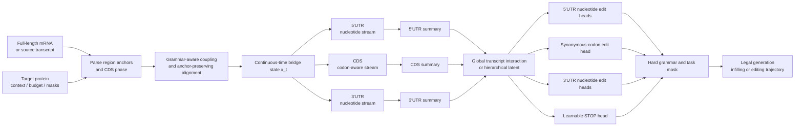

# mRNA-EditFlow

**Heterogeneous grammar-constrained Edit Flows for full-length protein-coding mRNA generation, infilling, and source-conditioned minimal editing.**

> **Research status — 2026-07-22**
>
> The publication contract and task hierarchy have been frozen through P3-00 and P3-00A. The scientific hypotheses remain **PENDING** until they pass their pre-registered data, predictor, optimization, independent-oracle, and prospective-experiment gates.
>
> Current computational results must be interpreted as engineering evidence or predicted/internal-proxy evidence unless explicitly labeled otherwise.

---

## 1. Overview

mRNA-EditFlow is based on a simple but consequential observation:

> A protein-coding mRNA is not a homogeneous nucleotide string.

Its regions obey different biological grammars:

- the **5′UTR** is a variable-length regulatory nucleotide sequence;
- the **CDS** is constrained by the target protein, genetic code, reading frame, start codon, and stop codon;
- the **3′UTR** is a variable-length regulatory sequence with context-dependent stability, localization, RBP, miRNA, splicing, and polyadenylation risks.

Therefore, the project models a full-length mRNA as a **heterogeneous continuous-time edit system** rather than applying one identical nucleotide process to every position.

The intended model unifies:

```text
full-length mRNA modeling
protein-conditioned CDS generation
5′UTR / CDS / 3′UTR infilling
source-conditioned minimal editing
optional property guidance
optional search
optional amortized reinforcement learning
```

The central methodological distinction is:

```text
UTRs:
    nucleotide-level variable-length flows

CDS:
    amino-acid-conditioned synonymous-codon flow
```

Protein identity, reading frame, region anchors, fixed positions, and edit budgets are intended to be guaranteed by the state/action space rather than encouraged through reward penalties or repaired after generation.

---

## 2. Frozen research contract

The authoritative P3 research contract is defined in:

- [`configs/p3_frozen_research_contract.yaml`](configs/p3_frozen_research_contract.yaml)
- [`configs/p3_primary_task.yaml`](configs/p3_primary_task.yaml)
- [`docs/p3_00_frozen_scientific_question.md`](docs/p3_00_frozen_scientific_question.md)
- [`docs/p3_00_claim_ladder.md`](docs/p3_00_claim_ladder.md)
- [`docs/p3_00_change_governance.md`](docs/p3_00_change_governance.md)
- [`docs/p3_00_hypothesis_preregistration.md`](docs/p3_00_hypothesis_preregistration.md)
- [`docs/p3_00_scientific_problem_lock.md`](docs/p3_00_scientific_problem_lock.md)
- [`docs/p3_00_go_no_go_matrix.json`](docs/p3_00_go_no_go_matrix.json)

Frozen artifacts must not be silently rewritten. Changes require an explicit amendment under the governance document.

---

## 3. Scientific questions

### 3.1 Method-level scientific question

> Should a full-length protein-coding mRNA be modeled as a homogeneous nucleotide sequence, or as a heterogeneous edit system composed of variable-length UTR nucleotide spaces and a protein-conditioned synonymous-codon CDS space?

The primary methods hypothesis is that, under matched data, backbone, parameter count, training tokens, optimization budget, and hardware protocol, an mRNA-specific grammar-constrained Edit Flow can achieve a better Pareto frontier across:

```text
generative quality
hard-constraint satisfaction
conditional controllability
region infilling flexibility
variable-length modeling
sampling efficiency
long-context stability
```

than:

```text
autoregressive generation
masked iterative generation
masked/discrete diffusion
generic discrete Flow Matching
generic Edit Flows
generic FlexFlow-style RNA models
```

---

### 3.2 Application-level scientific question

> Given a source mRNA that already expresses a target protein in a fixed cargo and cell context, can at most `k` legal substitutions improve real protein output while preserving the protein sequence, transcript length, reading frame, region anchors, and pre-registered manufacturing constraints?

The active application uses:

```text
edit budget k ∈ {1, 3, 5, 10}
primary endpoint = protein output over time
prediction target = output(candidate) - output(source)
```

The preferred primary endpoint is:

```text
protein-output AUC
```

or protein abundance measured at pre-registered time points.

Secondary endpoints include:

```text
mRNA abundance
apparent half-life
translation efficiency
protein output / mRNA abundance
ribosome load
IVT yield
sequence integrity
cell viability
innate-immune or dsRNA measurements where relevant
```

Translation efficiency, accessibility, GC content, codon usage, and structure scores must not be combined into an arbitrary proxy and presented as measured protein output.

---

## 4. Task hierarchy

The Base Model scope and the active application task are intentionally separated.

| Task | Definition | Status | Role |
|---|---|---:|---|
| Base method | Full-length heterogeneous grammar-constrained mRNA Edit Flow | **Primary method** | Main methodological contribution |
| Task A | 5′UTR source-conditioned minimal substitution | **Active primary** | First falsification and optimization application |
| Task B | CDS synonymous minimal substitution | **Frozen fallback** | Activated only by the pre-registered fallback rule |
| Task C | Joint 5′UTR + CDS substitution | **Locked extension** | Requires H1, H2, and H3 to pass independently in both regions |
| Task D | Full-transcript optimization including 3′UTR | **Rejected for primary paper** | Insufficient local intervention evidence and highest reward-hacking risk |
| Reinforcement learning | GRPO or another learned sequential policy | **Conditional extension** | Used only if it provides quality or amortization value |
| Cross-region synergy | Non-additive 5′UTR–CDS or full-transcript interaction | **Conditional extension** | A hypothesis, not an assumed property |
| Prospective wet lab | Measured protein-output validation | **Publication strengthener** | Required for measured biological claims |

Task A is the first application task. It is **not** the entire scope of the model.

---

## 5. What the project does not assume

The project explicitly rejects the following default assumptions:

```text
full-transcript optimization must outperform region-specific optimization

5′UTR, CDS, and 3′UTR must immediately enter one joint MDP

cross-region synergy must exist or have a large effect

a stronger backbone will automatically improve Edit Flow optimization

GRPO must outperform strong local search

greedy decoding is equivalent to the true flow marginal

an internal TE predictor is equivalent to real protein output

more edits are better than minimal edits

a high training-oracle score implies biological improvement

3′UTR editing is required for the first paper

reinforcement learning is required for the first paper

this is the first RNA Flow Matching model
```

These are hypotheses to evaluate, not premises used to justify the project.

---

## 6. Heterogeneous mRNA state space

Given a fixed target protein:

```text
a_1, a_2, ..., a_M
```

the intended state space is:

```text
X_mRNA =
    X_5UTR
    × X_CDS(a_1:M)
    × X_3UTR
```

where:

```text
X_5UTR =
    union over allowed lengths L of {A,C,G,U}^L

X_CDS(a_1:M) =
    product over amino-acid positions j of SynonymousCodons(a_j)

X_3UTR =
    union over allowed lengths L of {A,C,G,U}^L
```

This construction means that a CDS position is not an unconstrained nucleotide state.

For example, if amino-acid position `j` encodes leucine, its legal state is one of:

```text
UUA
UUG
CUU
CUC
CUA
CUG
```

rather than an independently selected `A`, `C`, `G`, or `U`.

Protein identity is therefore a state-space invariant rather than a post-generation filter.

---

## 7. Target model architecture

### 7.1 Model inputs

Depending on the task, the model receives:

```text
current or noisy mRNA x_t
continuous time t
5′UTR / CDS / 3′UTR boundaries
CDS codon phase
CDS codon index
target protein sequence
optional source mRNA
optional fixed-token mask
optional infilling mask
species / expression host
cell context
remaining edit budget
edit history
optional property condition
optional structural features
```

---

### 7.2 Dual-resolution region representation

Different regions are represented at different biological resolutions:

```text
5′UTR:
    nucleotide stream

CDS:
    codon stream
    +
    nucleotide-to-codon correspondence

3′UTR:
    nucleotide stream
```

Required invariants:

- CDS codon pooling starts from the true `cds_start`;
- BOS tokens and UTR length must not shift codon phase;
- UTR nucleotides must not be assigned artificial codon phases;
- each CDS codon representation maps only to its corresponding nucleotide triplet;
- synonymous candidate sets are generated directly from the genetic code.

---

### 7.3 Local and global encoding

The target architecture uses region-specialized local encoding followed by global transcript coordination:

```text
5′UTR nucleotide encoder
        │
        ├── 5′UTR local states
        └── 5′UTR summary token

CDS codon-aware encoder
        │
        ├── CDS local states
        └── CDS summary token

3′UTR nucleotide encoder
        │
        ├── 3′UTR local states
        └── 3′UTR summary token

region summaries
        ↓
global transcript interaction module
        ↓
region-conditioned local representations
```

Candidate global modules include:

```text
dense attention
local attention
codon-compressed attention
state-space models
attention–SSM hybrids
```

The module must be selected using a matched architecture benchmark rather than assumed in advance.

Context-length targets:

```text
4,096 nt:
    minimum paper-scale requirement

8,192 nt:
    stretch target, not an initial publication blocker
```

---

### 7.4 Hierarchical latent coordination

A FlexFlow-style shared latent may be extended into a hierarchical representation:

```text
global transcript latent
├── 5′UTR latent
├── CDS latent
├── 3′UTR latent
└── optional structure / context latent
```

The global latent coordinates transcript-wide decisions, while region latents preserve region-specific biological grammar.

Possible conditioning includes:

```text
target protein
source transcript
species
expression host
cell context
target region lengths
edit budget
fixed positions
property profile
manufacturing profile
```

---

### 7.5 Grammar-aware coupling

The model must separate generic sequence coupling from mRNA-specific coupling.

Required coupling ablations:

```text
uniform coupling
mask coupling
generic nucleotide substitution coupling
region-aware coupling
amino-acid-conditioned codon coupling
complete mRNA grammar coupling
```

CDS coupling may incorporate:

```text
target amino acid
synonymous codon graph
host codon usage
tRNA adaptation
codon-pair context
source codon proximity
local GC
local RNA structure
start-proximal position
```

UTR coupling may incorporate:

```text
region identity
source-sequence proximity
local structure
motif preservation
start-region context
on-manifold likelihood
```

Biological preferences used in coupling must not be confused with hard legality rules.

---

### 7.6 Anchor- and frame-preserving alignment

The model defines fixed transcript anchors:

```text
5′UTR/CDS boundary
start codon
CDS codon boundaries
stop codon
CDS/3′UTR boundary
```

UTRs may use blank-augmented nucleotide alignment for insertion, deletion, and substitution.

CDS alignment is codon-level:

```text
source codon
    →
target synonymous codon
```

A legal CDS flow path must not pass through:

```text
nonsynonymous intermediate states
frameshift intermediate states
internal stop codons
single-nucleotide illegal CDS states
```

---

### 7.7 Atomic edit actions

The full target action vocabulary is:

```text
5′UTR:
    UTR5_SUB(position, nucleotide)
    UTR5_INS(position, nucleotide)
    UTR5_DEL(position)

CDS:
    CDS_SYN_CODON_SUB(
        codon_position,
        target_synonymous_codon
    )

3′UTR:
    UTR3_SUB(position, nucleotide)
    UTR3_INS(position, nucleotide)
    UTR3_DEL(position)

GLOBAL:
    STOP
```

Default forbidden actions:

```text
CDS nucleotide-level insertion
CDS nucleotide-level deletion
nonsynonymous CDS substitution
single-nucleotide CDS transition through an illegal intermediate
premature-stop-producing action
reading-frame-breaking action
```

The active Task A contract is narrower:

```text
allowed:
    5′UTR substitutions

forbidden:
    all insertions
    all deletions
    all CDS edits
    all 3′UTR edits

edit budget:
    1, 3, 5, or 10
```

---

### 7.8 Output heads

The target model predicts non-negative transition rates and conditional edit targets.

Conceptually:

```text
5′UTR heads:
    insertion rate
    substitution rate
    deletion rate
    insertion-nucleotide distribution
    substitution-nucleotide distribution

CDS head:
    synonymous-codon substitution rate
    target synonymous-codon distribution

3′UTR heads:
    insertion rate
    substitution rate
    deletion rate
    insertion-nucleotide distribution
    substitution-nucleotide distribution

Global head:
    learnable STOP rate or probability
```

For large action spaces, the policy may be factorized hierarchically:

```text
P(STOP or EDIT | state)
× P(region | EDIT, state)
× P(operation | region, state)
× P(position | operation, region, state)
× P(target nucleotide or codon | position, state)
```

The implementation must expose the complete joint action log-probability for:

```text
Flow Matching losses
trajectory likelihoods
KL regularization
importance ratios
search
optional reinforcement learning
```

---

### 7.9 Hard-constraint gate

The following constraints must be enforced before an action can be sampled:

```text
target-protein identity
reading frame
start codon
stop codon
region anchors
editable-region contract
fixed-token contract
remaining edit budget
maximum transcript length
visited-state or cycle rules
motif_policy_v1 hard-forbidden rules
```

Hard constraints must not be replaced by negative reward.

Context-dependent motif risks remain:

```text
guarded risks
or
soft objectives
```

unless pre-registration explicitly classifies them as universally illegal.

---

## 8. Architecture diagram



---

## 9. Supported task families

### 9.1 Full-length distribution modeling

Purpose:

```text
learn region grammar
learn transcript-length distributions
learn codon distributions
learn cross-region sequence dependencies
```

Evaluation:

```text
held-out generative objective
region validity
length-distribution distance
k-mer distribution
codon-usage distance
diversity
novelty
long-context stability
foundation-model likelihood where appropriate
```

This task does not establish functional improvement.

---

### 9.2 Protein-conditioned CDS generation

Input:

```text
target protein
optional host/species context
optional source CDS
```

Output:

```text
valid synonymous CDS
```

Mandatory hard metrics:

```text
protein identity = 100%
reading-frame validity = 100%
valid start codon = 100%
valid stop codon = 100%
no internal stop = 100%
```

Additional evaluation:

```text
CAI
tAI
codon-pair score
GC / GC3
MFE
ensemble free energy
diversity
novelty
generation speed
```

---

### 9.3 Conditional UTR generation

Input may include:

```text
CDS or start-region context
target UTR length
species / cell context
target predicted-property bin
fixed motif constraints
```

Evaluation:

```text
conditional target error
conditional monotonicity
uAUG / uORF risk
Kozak consistency
motif risk
structure distribution
diversity
novelty
independent-predictor transfer
```

Predicted properties must be labeled as predicted properties.

---

### 9.4 Region infilling

Supported slices:

```text
5′UTR infilling
CDS synonymous-codon span infilling
3′UTR infilling
multi-region infilling
random-span infilling
fixed-token constrained infilling
```

Evaluation:

```text
fixed-token preservation
protein identity
span quality
conditional quality
diversity
number of function evaluations
wall-clock
memory
```

Infilling is a central task for demonstrating the flexibility of a non-autoregressive edit process.

---

### 9.5 Full-length conditional generation

Input:

```text
target protein
target region lengths
species / host
optional property profile
```

Output:

```text
5′UTR + CDS + 3′UTR
```

This task must be evaluated separately from source-conditioned minimal editing because the input/output contract and notion of sequence preservation are different.

---

### 9.6 Source-conditioned minimal editing

Input:

```text
source mRNA
fixed target protein
edit budget
allowed regions
cell / cargo context
hard constraints
```

Output:

```text
at most k legal edits
or STOP
```

Primary computational metrics:

```text
independent predicted delta
beneficial-edit precision
top-k beneficial enrichment
positive-improvement rate
reward per edit
edit-budget Pareto frontier
source preservation
query count
wall-clock
uncertainty
abstention quality
hard-constraint validity
```

Measured expression, stability, translation, or protein-output claims require prospective experiments.

---

## 10. Local-delta prediction

The central optimization predictor is not only:

```text
candidate sequence
    →
absolute output
```

The project compares:

```text
candidate-only absolute predictor

source + candidate predictor

Siamese source/candidate predictor

source-candidate difference model

source representation
    +
sparse edit tokens
    →
local delta

source↔candidate cross-attention model
```

The prediction target is:

```text
delta =
    measured_or_proxy(candidate)
    -
    measured_or_proxy(source)
```

Primary local-effect metrics include:

```text
delta Spearman
delta Pearson
sign accuracy
pairwise ranking AUC
beneficial-edit precision
top-k enrichment
false-positive beneficial rate
source-normalized RMSE
calibration error
```

Global sequence-level Pearson correlation alone is not sufficient evidence for design optimization.

---

## 11. Closest baseline

The required closest baseline is:

# Generic FlexFlow-mRNA

It should use:

```text
full-length RNA alphabet
generic nucleotide insertion/substitution/deletion
generic structured coupling
single global latent
no region-specific state grammar
no amino-acid-conditioned codon state
no frame-preserving codon bridge
no minimal-edit task semantics
```

This comparison isolates whether improvements come from the mRNA-specific biological grammar or merely from applying a generic Edit Flow to RNA data.

---

## 12. Matched-paradigm baseline contract

The core matched comparison must hold constant:

```text
training data and split
input information
backbone
parameter count
training tokens
number of updates
optimizer family
hardware class
evaluation protocol
```

Core paradigms:

```text
autoregressive Transformer
masked iterative model
masked/discrete diffusion
generic discrete Flow Matching
Edit Flows
FlexFlow / Generic FlexFlow-mRNA
mRNA-EditFlow
```

A second best-system comparison may tune each paradigm more freely, but it must not replace the matched-capacity comparison.

---

## 13. Task-aligned external baselines

External methods must be grouped by compatible task.

### CDS or codon design

```text
LinearDesign
EnsembleDesign
codonGPT
Prot2RNA
other executable synonymous-codon methods
```

### 5′UTR generation or optimization

```text
UTR-LM-compatible methods
UTRGAN
UTailoR
RNACG-compatible methods
other executable 5′UTR systems
```

### Full-length de novo generation

```text
GEMORNA
mRNA-GPT
ProMORNA
mRNAutilus
other executable full-length systems
```

### Source-conditioned optimization

```text
random legal editing
exact one-edit enumeration
exact two-edit enumeration where tractable
greedy
ranker
beam search
simulated annealing
MCTS
oracle-guided local search
flow guidance
ranker + limited search
optional learned policy
```

There is no single mixed leaderboard combining CDS-only, UTR-only, full-length de novo, and source-conditioned minimal-edit methods.

---

## 14. Search before reinforcement learning

Before large-scale reinforcement learning, the project must establish the strong-search ceiling under matched query budgets.

Required query budgets:

```text
32
128
512
2048
```

Required edit budgets:

```text
1
3
5
10
```

Required reporting:

```text
final quality
oracle calls
wall-clock
GPU memory
reward per edit
positive-improvement rate
full training cost
new-source inference cost
deployment break-even scale
```

Possible outcomes:

### Route A — RL quality gain

```text
learned policy > strongest search
under the same inference-time query budget
```

### Route B — RL amortization gain

```text
learned policy ≈ strongest search quality
but new-source inference is substantially cheaper
```

### Route C — RL not required

```text
ranker + limited search is near-optimal
and RL adds neither quality nor cost value
```

Route C remains a valid paper outcome.

---

## 15. Reinforcement-learning contract

GRPO or another learned policy is used only after:

```text
local effects exist
local deltas are predictable
optimization headroom exists
strong search has been evaluated
RL has a quality or amortization rationale
```

A production policy implementation must guarantee:

```text
frozen rollout-policy snapshot
frozen old log-probabilities
multiple policy-update epochs
deterministic policy forward with gradients enabled
identical rollout/update legal action sets
complete visited-state history
risk-adjusted reward entering the advantage
frozen reference policy
auditable KL and clip fraction
learnable STOP
checkpoint-resume consistency
```

RL must not compensate for:

```text
invalid actions
reward leakage
weak predictor validation
missing independent oracle
insufficient search baselines
```

---

## 16. Claim ladder

| Level | Claim enabled |
|---|---|
| C0 | Correct heterogeneous state/action space and auditable flow implementation |
| C1 | Matched-capacity modeling, constraint, controllability, or efficiency advantage |
| C2 | Conditional generation with explicitly labeled **predicted** properties |
| C3 | Source-conditioned improvement that transfers to independent predictors |
| C4 | Independent search, flow-guidance, RL-quality, or RL-amortization value |
| C5 | Prospectively measured protein output, abundance, half-life, or TE improvement |
| C6 | Transferable cross-region, edit-order, or regulatory biological mechanism |

P3-00 PASS means:

```text
the research contract is frozen
the task hierarchy is defined
the hypotheses are falsifiable
the pause and unlock rules exist
```

It does not mean that H1–H6 or any biological-improvement claim has passed.

---

## 17. Data hierarchy

### Level A — Observational sequence data

Examples:

```text
full-length transcripts
RNA abundance
ribosome-profiling TE
half-life
cell context
```

Use:

```text
pretraining
representation learning
absolute-prediction auxiliary tasks
```

Observational data alone is not sufficient evidence for local edit effects.

---

### Level B — Cross-construct design libraries

Examples:

```text
full-length reporter libraries
UTR design libraries
CDS design libraries
PERSIST-seq-like measurements
```

Use:

```text
sequence ranking
region sensitivity
mechanistic analysis
```

---

### Level C — Source-matched local perturbations

Required structure:

```text
source
candidate
edit list
edit count
measured delta
```

This is the most important data level for local-delta prediction and minimal-edit optimization.

---

### Level D — Prospective project data

Generated through pre-registered experimental panels containing:

```text
frozen source sequences
frozen candidate sequences
selection rules
measured protein output
measured mRNA abundance
cell context
replicates
batch information
```

---

## 18. Split and leakage contract

The following must be grouped or audited:

```text
all candidates from the same source
near-identical source sequences
same cargo
same protein
same protein family
orthologs
same experimental library
same reporter backbone
same cell-context library
```

Recommended split structure:

```text
train:
    source-disjoint

validation:
    source-disjoint

test:
    cargo- or protein-family-disjoint

OOD:
    length shift
    GC shift
    species shift
    rare family
    cell-context shift
    reporter-to-therapeutic shift
```

A mutation from one source must never enter training while another mutation from the same source enters validation or test.

---

## 19. Current repository status

### 19.1 Existing infrastructure

The repository already includes infrastructure for:

```text
public mRNA preprocessing
region and codon-phase tracks
variable-length alignment
CTMC-style edit modeling
MRNAEditFormer training and sampling
region-specialized adapters
proposal rankers
constraint-safe decoding
external baseline adapters
UTR local search
synonymous-codon dynamic programming
DAgger prototypes
multi-objective reward records
trajectory auditing
GRPO prototypes
multi-seed evaluation
bootstrap and permutation tests
leakage audits
artifact manifests
```

---

### 19.2 Current limitations

The frozen target architecture is not yet fully implemented or validated.

Important remaining gaps include:

```text
paper-grade real backbone integration

healthy long-context training

atomic synonymous-codon state transitions
through all relevant CDS code paths

Generic FlexFlow-mRNA baseline

matched AR / diffusion / flow comparison

source-matched local intervention benchmark

reliable local-delta oracle

independent-oracle transfer

equal-query strong-search comparison

reward-hacking audit

prospective experimental validation
```

Current predicted or internal-oracle improvements are not measured biological improvements.

Existing 5′UTR model-only results remain below strong UTR methods and oracle-guided local-search ceilings on current audited slices. Negative results and failed seeds must remain visible.

Detailed evidence is stored under:

- [`benchmark/`](benchmark/)
- [`docs/sota_gap_report.md`](docs/sota_gap_report.md)
- [`docs/t5_external_utr_baseline_comparison.md`](docs/t5_external_utr_baseline_comparison.md)
- [`docs/p3_00_scientific_problem_lock.md`](docs/p3_00_scientific_problem_lock.md)
- [`docs/p3_00_hypothesis_preregistration.md`](docs/p3_00_hypothesis_preregistration.md)
- [`docs/p3_00_go_no_go_matrix.json`](docs/p3_00_go_no_go_matrix.json)

---

## 20. P3 execution order

```text
P3-00 / P3-00A
    Frozen scientific question and publication contract
    STATUS: PASS

P3-01
    Local-intervention data and benchmark freeze
    STATUS: NEXT

P3-02
    Local-delta oracle and optimization-headroom gate

P3-03
    Early prospective falsification

P3-04
    Generic DFM / Edit Flows / FlexFlow baselines

P3-05
    Heterogeneous mRNA grammar state space and target architecture

P3-06
    Matched paradigm and core generation/infilling benchmark

P3-07
    Source-conditioned minimal editing and strong search

P3-08
    RL necessity and correctness gate

P3-09
    Production GRPO only if Route A or Route B is justified

P3-10
    Reliability, OOD, synergy, 3′UTR, and experimental extensions

P3-11
    Paper freeze and one-command reproduction
```

A dependent phase must fail closed if a required contract, dataset, split, checkpoint, config, or artifact hash is absent.

---

## 21. Installation

```bash
git clone https://github.com/Cunyu-Liu/mRNA_editflow.git
cd mRNA_editflow

python3 -m venv .venv
source .venv/bin/activate

pip install -r requirements.txt
```

Recommended optional tools:

| Tool | Purpose |
|---|---|
| MMseqs2 | Protein- and sequence-family clustering |
| ViennaRNA / RNAfold | Higher-fidelity structural features |
| CUDA-enabled PyTorch | Large-scale training and evaluation |

---

## 22. Minimal public-data smoke workflow

Build a small GENCODE slice:

```bash
python3 -m mrna_editflow.data.public_pipeline \
  --download \
  --dataset gencode_human_transcripts \
  --data-dir data/raw \
  --out-dir data/processed \
  --limit 512 \
  --seed 20260714
```

Run the test suite:

```bash
pytest -q
```

Verify the frozen P3 contract:

```bash
pytest tests/test_p3_00_task_contract.py -q
```

Run a development Stage A smoke test:

```bash
python3 -m mrna_editflow.train_backbone \
  --records-jsonl data/processed/gencode_human_transcripts.records.jsonl \
  --steps 1000 \
  --save-dir ckpts/stage_a_smoke \
  --profile-path benchmark/stage_a_smoke.profile.jsonl \
  --seed 20260714 \
  --device cuda
```

These commands validate engineering plumbing. They are not paper-grade training or biological evidence.

---

## 23. Reproducibility contract

Paper-mode runs must record:

```text
code commit
configuration hash
dataset hash
split hash
tokenizer identity
backbone identity
backbone checkpoint hash
training seed
decoding seed
hardware
runtime
oracle calls
failed-run records
output artifact hashes
```

Paper mode must fail closed when encountering:

```text
placeholder backbone
development-only oracle
missing split
missing hash
unfrozen test set
incomplete external adapter
unknown checkpoint provenance
```

All failed seeds, failed sequences, negative results, and protocol deviations must be retained.

---

## 24. Statistical contract

Development-scale experiments may use three seeds.

Architecture-freeze experiments should use at least five independent training seeds.

Paper-grade stochastic decoding, search, guidance, or RL comparisons should use ten seeds where feasible.

The biological unit of inference is not the decoding seed. Statistical analysis must use source-, cargo-, or family-aware procedures such as:

```text
clustered bootstrap
paired permutation tests
mixed-effects models
multiple-comparison correction
effect sizes
confidence intervals
failure-rate reporting
```

Confidence-interval non-overlap must not replace a formal paired comparison.

---

## 25. Publication target

### Minimum computational methods paper

Required:

```text
mRNA-specific heterogeneous grammar contribution
Generic FlexFlow-mRNA closest baseline
matched AR / diffusion / flow comparison
protein-conditioned CDS generation
region infilling
source-conditioned minimal-edit benchmark
hard-constraint audit
strong task-aligned external baselines
complete ablations
retained negative results
reproducible public artifacts
```

RL is not required.

Cross-region synergy is not required.

---

### Strong computational design paper

Adds:

```text
reliable local-delta prediction
independent-predictor transfer
query-efficient flow guidance or search
OOD evaluation
reward-hacking audit
uncertainty and abstention
```

---

### Experimental mRNA design paper

Adds:

```text
prospective candidate freeze
measured protein output
measured mRNA abundance
multi-cargo or strong reporter validation
proxy-to-assay transfer analysis
```

---

### High-impact mechanism paper

Additionally requires:

```text
multiple cargos
multiple contexts
reproducible biological gain
strong external-baseline advantage
cross-region or multi-step mechanism
biological interpretation
therapeutic relevance
```

A simple replacement of an existing architecture with Flow Matching is not sufficient for a top-tier biological paper.

---

## 26. Governance

The P3 scientific question, task hierarchy, and claim ladder are frozen.

They may change only through an explicit amendment under:

[`docs/p3_00_change_governance.md`](docs/p3_00_change_governance.md)

Forbidden practices include:

```text
silently rewriting the primary task
changing thresholds after seeing results
moving failed families out of the test set
dropping failed seeds
weakening strong baselines to preserve an RL story
unlocking 3′UTR without gate evidence
claiming measured improvement from an internal predictor
overwriting frozen artifacts without an amendment
```

The project route must be selected by evidence rather than fixed in advance as an RL, full-transcript, or synergy paper.

---

## 27. Project summary

mRNA-EditFlow is ultimately testing the following evidence chain:

```text
mRNA has a heterogeneous biological edit geometry
        ↓
that geometry can be represented explicitly
        ↓
grammar-aware Edit Flow improves modeling or control
        ↓
local mRNA edit effects exist
        ↓
local edit effects can be predicted
        ↓
legal edit neighborhoods contain optimization headroom
        ↓
guidance or strong search can find improved candidates
        ↓
a learned policy is used only if independently justified
        ↓
improvements transfer to independent predictors
        ↓
improvements transfer to prospective assays
        ↓
optional: transferable cross-region mechanisms exist
```

The project is committed to mRNA design, but not to a predetermined algorithmic story.

The primary contribution is intended to be:

> A heterogeneous, grammar-constrained discrete edit-flow framework that unifies variable-length UTR nucleotide flows with protein-conditioned synonymous-codon CDS flows for full-length mRNA generation, infilling, and source-conditioned minimal editing.
