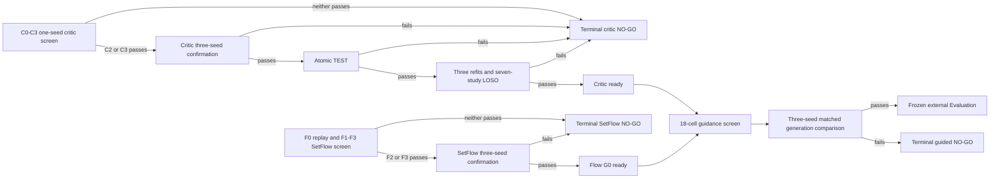

# Prospective Experiments Protocol: XEditCritic V3 and XEditSetFlow V3

> Status: frozen experiment-writing and reporting plan; not a Results section. It
> does not assert that any running V3 arm, confirmation gate, TEST, LOSO, guided
> comparison, or external Evaluation has passed. Terminal V2 results remain
> unchanged, and a failed V3 gate remains a reportable terminal result.

## Experimental questions

- **RQ1 — prediction:** Does edit-local, endpoint-aware XEditCritic V3 improve source-relative effect ranking over a matched same-information raw baseline across tasks and studies?
- **RQ2 — unordered generation:** Does set-marginal training improve the likelihood and recovery of measured terminal edit sets while retaining all `SUB + STOP` correctness guarantees?
- **RQ3 — non-myopic guidance:** Does scalar soft-value guidance with SMC improve closed measured-neighborhood ranking beyond unguided generation, first-order guidance, one-step rate guidance, reranking, and frozen matched search?
- **RQ4 — robustness:** Are the prediction and generation gains reproducible across exactly three training seeds, paired source or source-group resampling, held-out studies, and matched compute?
- **RQ5 — external scope:** After every internal component is frozen, does one new outcome-unexposed Evaluation reproduce the direction of the critic and generation effects?

The primary paper claim requires affirmative evidence for RQ1 and RQ3; RQ2 establishes that the upgraded generator is a viable unguided model rather than only a guidance carrier. RQ4 is required for a cross-task or cross-study model claim. RQ5 is required before describing the result as independently externally confirmed.

## Evidence flow and stopping rules

No later evidence is inspected after an upstream NO-GO. No threshold, task, baseline, seed count, or hyperparameter grid is changed in response to a result. Decoder streams describe sampling variability and are not promoted to independent training replicates.

## Data, split, and information controls

All model fitting uses label-bearing `DevelopmentProjectionV3` TRAIN/VALIDATION artifacts. Development TEST rows are not fully decoded during projection construction, and no general TEST projection is available. A passing critic confirmation gate can authorize one atomic frozen candidate-versus-C0 TEST evaluation. New Evaluation outcomes remain inaccessible until the entire predictor, generator, metric, baseline, and adaptation policy is frozen.

Every critic arm receives identical outcome-free endpoint descriptors, including quantity family, measurement form, ratio semantics, region, assay, and context. Study identity is not supplied to the shared effect trunk; it is restricted to multiplicative scale calibration, with unseen-study scale fixed at one. SetFlow and value training receive no study identity, independent-evaluator score, critic target score, TEST outcome, or Evaluation outcome.

The prediction screen uses 89,580 TRAIN and 18,293 VALIDATION records from the frozen projection. The generation screen uses its frozen 68,294/15,924 TRAIN/VALIDATION support and the same protected-data boundary recorded by the runner. Exact cohort identity and support counts are gate inputs rather than descriptive metadata.

## RQ1: critic comparison

The screen seed is 20260830. C0 is the endpoint-aware raw matched baseline; C1 adds only the legacy whole-sequence mRNABERT mean; C2 adds the frozen edit-site token branch; C3 adds the predeclared last-four-block LoRA adapters. Only C2 and C3 are selectable. All four arms share the split, endpoint information, sampler, eight passes, 22,416 updates, BF16/CUDA training budget, and final-pass checkpoint rule.

The primary screen outcome is task-macro Spearman, with task-macro standardized MAE, positive-task count, taskwise margin over C0, prediction spread, and protected-read counters as co-primary gate evidence. C2/C3 additionally face source-only, edit-metadata-only, parameter-matched no-candidate-sequence, and complete candidate-bundle permutation controls. Controls are causal diagnostics, not substitute baselines and not optional rows.

If one selectable arm passes, it and a matched C0 are trained at seeds 20260831, 20260901, and 20260902. The confirmation table reports every seed rather than only a mean. Paired confidence intervals resample source groups within task; the reported macro difference is recomputed within each bootstrap replicate. The subsequent atomic TEST uses the frozen ensembles once. Seven-study LOSO then reports every held-out fold and separately identifies leave-GSE269595-out as the dense-study dependence stress test.

### Planned critic tables

| Table | Statistical unit | Required rows | Required columns | Message |
|---|---|---|---|---|
| C-Screen | Task macro plus nine task rows | C0, C1, C2, C3 | Spearman ↑, standardized MAE ↓, positive tasks, C0 margin ↑, controls passed, trainable parameters | Whether local representation or adaptation earns confirmation |
| C-Confirm | Training seed | selected C2/C3 and matched C0 for all three seeds | Spearman ↑, paired margin ↑, 95% CI, standardized MAE ↓, task breadth | Whether the critic advantage is reproducible rather than seed-selected |
| C-Test | Task macro plus task rows | frozen three-member model and baseline ensembles | Spearman ↑, standardized MAE ↓, paired margin ↑, 95% CI, task breadth | One-shot held-out Development evidence |
| C-LOSO | Held-out study by seed | selected critic and matched C0 | Spearman ↑, margin ↑, support, unknown-study scale | Cross-study readiness and dense-study dependence |

The C-Screen caption must state that seed 20260830 is a screen rather than an independent confirmation replicate. The C-Test caption must state that it is the sole authorized TEST read and was not used for method revision.

## RQ2: unguided set-flow comparison

F0 is the terminal 817,957-parameter Base Flow V2 checkpoint replayed without training under the common set-marginal NLL. F1 changes the objective while retaining the small legacy trunk and is diagnostic only. F2 and F3 are the selectable 16,179,014- and 42,197,158-parameter hybrid models. The screen uses seed 20260903, at most twelve passes, and patience-two early stopping on the common Validation set-marginal NLL; it never selects on generated critic self-score.

The main comparison separates likelihood from generation behavior. Common set-marginal NLL tests the unordered target distribution under one definition. Source-macro candidate recovery, top-k recovery, and unique-candidate rate test open-support behavior. Hard legality, edit/candidate budget, STOP cause, replay, and numerical counters test engineering validity. An arm cannot trade a correctness failure for a better recovery value.

The selected F2/F3 architecture is trained exactly at seeds 20260904, 20260905, and 20260906. Each seed must independently satisfy the confirmation gate; the paper reports all three and does not append a replacement seed.

### Planned SetFlow tables

| Table | Statistical unit | Required rows | Required columns | Message |
|---|---|---|---|---|
| F-Screen | Source macro | frozen F0 replay, F1, F2, F3 | common NLL ↓, F0 reduction ↑, recovery ↑, top-k recovery ↑, unique rate ↑, correctness counters, parameters | Objective-only versus capacity-enabled improvement |
| F-Confirm | Training seed | selected F2/F3 for three seeds | recovery ↑, top-k recovery ↑, unique rate ↑, legality, budget/replay/numerical failures | Reproducible unguided readiness |

## RQ3: guidance and generation comparison

Only jointly ready critic and SetFlow artifacts can create value targets. The one-time Validation screen enumerates the complete preregistered grid: uncertainty penalty \(\kappa\in\{0,0.5,1\}\), temperature \(\tau\in\{0.5,1\}\), and maximum guidance strength \(\beta_{\max}\in\{0.5,1,2\}\). It uses base-flow training seed 20260904 and selects lexicographically by closed NDCG, normalized regret, independent-evaluator paired margin, open recovery, then lower compute. The selected triple is immutable for the other two seeds.

The final comparison includes the full soft-value SMC method, the same selected SetFlow without guidance, ordinary first-order guidance, one-step critic-rate guidance, generate-then-rerank, and the strongest frozen matched generation/search baseline. The auxiliary frozen random, greedy, beam, genetic, and local-search policies remain visible for benchmark breadth. Their forced closed-neighborhood rows share the same frozen terminal scorer and therefore the same closed ranking; their distinct search behavior is evaluated only on the open generated support.

Every method receives a candidate cap of 32 and a ceiling of 320 forward-equivalents per source. Base-flow, value-network, and all three critic-member calls are separately charged. Main compute reporting contains same-cohort wall time and peak VRAM, with an equal-wall-time sensitivity analysis. A method exceeding the ceiling fails matched-compute eligibility; its score is not silently normalized into compliance.

Equal-wall reporting is computed from GPU-synchronized A100 per-source measurements under one standardized scope: generation, replay where applicable, and scoring required for candidate selection are included; post-hoc diagnostic-only scoring is excluded. All six methods must use the same exact A100 model. The wall budget is the minimum six-method full-cohort time, and all metrics are recomputed on the same fully completed prefix of the frozen source order. Missing per-source timing, non-A100 or mixed-model execution, source-order drift, incomplete closed support, or an uninstrumented historical artifact makes the sensitivity artifact incomplete. The frozen genetic baseline therefore receives one timing-only benchmark execution with no reselection, no new HPO, and no change to its terminal performance result.

### Planned generation tables

| Table | Statistical unit | Required rows | Required columns | Message |
|---|---|---|---|---|
| G-Closed | Source macro by training seed | full SMC, unguided, first-order, one-step rate, rerank, strongest search baseline | NDCG ↑, paired NDCG difference ↑ with 95% CI, normalized regret ↓, regret reduction ↑, top-1 recall ↑, defined sources | Measured-neighborhood ranking under common terminal support |
| G-Open | Source macro by training seed | all final and auxiliary methods | recovery ↑, top-k recovery ↑, unique rate ↑, evaluator paired margin ↑ with 95% CI, legality/failure counters | Open-support behavior without assigning outcomes to unknown candidates |
| G-Compute | Source and cohort aggregate | all compared methods | candidates, base/value/critic forwards, forward-equivalents ↓, wall time ↓, peak VRAM ↓ | Accuracy–compute trade-off under declared accounting |

Closed NDCG is undefined for sources with fewer than two legal measured candidates and is never filled with zero. The closed benchmark and open-support recovery answer different questions and are never merged into a composite score. Critic self-score appears only in a mechanism-diagnostic appendix; higher self-score without measured NDCG/regret and independent-evaluator improvement is labeled reward exploitation.

## RQ4: ablations, exactness, and robustness

The core critic ablation is the preregistered C0/C1/C2/C3 comparison plus the three negative controls. It tests raw sequence, global pretrained residual, edit-local pretrained representation, and limited encoder adaptation without post-result architecture growth. The core flow ablation separates the set-marginal objective (F1), moderate hybrid capacity (F2), and maximum frozen capacity (F3). The guidance ablation compares scalar non-myopic potential guidance against unguided, first-order, one-step rate, and terminal reranking alternatives.

Implementation invariants are reported separately from performance: strict critic antisymmetry and identity-zero behavior; cache/online token agreement; ragged edit preservation; permutation-invariant set loss; STOP versus structural budget exhaustion; pre-normalization legal masking; exact terminal probability on small graphs; SMC ESS and stratified resampling; replay; and independent-evaluator gradient exclusion. Passing these tests establishes that the intended method was run, not that it performs well.

Robustness evidence includes taskwise critic values, every seed, every LOSO fold, the dense-study stress test, source/source-group paired bootstrap intervals, equal-wall-time sensitivity, and failure analysis by endpoint family, edit depth, sequence length, and measured-neighborhood size. Subgroups remain descriptive unless separately preregistered; they cannot rescue a failed primary gate.

## RQ5: external confirmation and claim boundary

The external Evaluation is run at most once after all internal choices are frozen. It must be a new, outcome-unexposed, schema-convertible study. The report includes cohort construction, endpoint mapping, zero-shot study-neutral handling, frozen critic rank metrics, frozen generation closed NDCG/regret where defined, and all exclusions. The external study must reproduce the direction of both critic ranking and generation NDCG/regret before supporting the strong model claim.

If no lawful replacement Evaluation becomes available, the report may describe a Development benchmark, TEST-preserving LOSO, historical transfer with exposure labels, and generation limitations. It must not claim independent external confirmation, experimentally validated biological improvement, or final submission readiness under the present model-plus-benchmark publication standard.

## Figure plan

1. **Figure 1 — method and evidence boundary.** Projection, edit-local critic, set-flow, frozen reward, scalar value, SMC, and the one-way gate sequence. Caption distinguishes trainable paths from evaluation-only paths.
2. **Figure 2 — critic evidence.** Seedwise task-macro rank performance with task-level points and paired C0 differences; a separate panel shows LOSO fold margins. Axes identify Spearman as higher-is-better.
3. **Figure 3 — generator evidence.** Three-seed paired closed NDCG and regret differences, with open recovery and evaluator margin in separate panels. No self-score is placed in the main success panel.
4. **Figure 4 — compute frontier and failures.** NDCG versus forward-equivalents and equal-wall-time sensitivity, followed by endpoint/edit-depth failure slices. Undefined closed sources are reported as support counts, not zero-valued points.

## Results-writing rules

- Lead each subsection with the frozen question and primary estimand, then report every required seed and its uncertainty before interpreting mechanisms.
- Use “passed” only when the machine gate validates exact artifact identity, support, compute, confidence interval, and protected-read evidence.
- Report negative and mixed task/fold results in the main table; do not move inconvenient required rows to an appendix.
- Distinguish screen evidence, confirmation evidence, Development TEST, LOSO, historical outcome-exposed transfer, and new external Evaluation in every caption and claim.
- Interpret rank improvement as better prioritization of measured candidates, not as proof of therapeutic efficacy or biological optimization.
- Keep metric directions and support counts in table headers; use consistent precision and booktabs formatting in the final manuscript.

## Claim-to-experiment map

| Proposed claim | Decisive experiment | Necessary supporting evidence | Current status |
|---|---|---|---|
| Edit-local Critic V3 improves cross-task ranking | C-Confirm, then C-Test | C-Screen controls, taskwise breadth, source-group CI, LOSO | Needs terminal evidence |
| SetFlow V3 better models legal terminal edit sets | F-Screen and F-Confirm | common-NLL replay, recovery, exactness and G0 counters | Needs terminal evidence |
| Soft-value SMC improves measured-neighborhood prioritization | G-Closed across three training seeds | G-Open evaluator margin, G-Compute, guidance ablations, paired CIs | Gate-blocked; needs terminal evidence |
| The benchmark provides fair model/search comparison | G-Closed, G-Open, and G-Compute | common support, shared-scorer provenance, exact accounting | Protocol implemented; result artifacts pending |
| The method generalizes beyond Development | C-LOSO plus one new external Evaluation | frozen zero-shot endpoint mapping and generation direction | Needs evidence; not externally confirmed |
