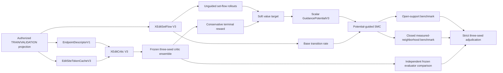

# Prospective Methods Addendum: XEditCritic V3 and XEditSetFlow V3

> Status: prospectively frozen method text; not a Results section. No statement in
> this document asserts that a V3 performance gate has passed. The terminal V2
> results and the current manuscript claim boundaries remain unchanged until the
> corresponding V3 artifacts are complete and adjudicated.

## Compact section outline

- Define source-relative prediction and legal set-valued generation under strict Development/Evaluation separation.
- Represent edited nucleotides with local mRNABERT token features and model their effects with an antisymmetric hierarchical critic.
- Learn unordered terminal edit sets with a set-marginal flow objective rather than a single arbitrary edit order.
- Convert a frozen three-member critic ensemble into a conservative terminal reward and a scalar soft value-to-go.
- Sample with potential-consistent sequential Monte Carlo while preserving hard `SUB + STOP` legality.
- Evaluate closed measured-neighborhood ranking, open-support recovery, independent-evaluator behavior, and matched compute as separate estimands.
- Apply prospective screen, confirmation, TEST, LOSO, guidance, and external-confirmation gates without result-contingent threshold changes.

## Pipeline sketch

## 1. Problem setting and evidence separation

**Paragraph role — opening.** We study source-relative mRNA editing in two coupled but separately adjudicated tasks. Given a source sequence, an assay and biological context, a transcript region, and an outcome-free endpoint description, the prediction task estimates the measured effect of a candidate relative to its source. The generation task produces a set of substitution-only candidates under source-specific edit budgets and an explicit stop action. The central methodological aim is to improve both cross-task effect ranking and the distribution of legal terminal edit sets, while the benchmark aim is to distinguish prediction, closed measured-neighborhood ranking, open-support generation, search efficiency, and cross-study transfer rather than collapsing them into one score.

**Paragraph role — challenge.** Strict data separation is part of the method because the Development TEST and a future external Evaluation determine claim eligibility. New training code accepts only `DevelopmentProjectionV3` artifacts for TRAIN and VALIDATION. The projection builder extracts a canonical record identifier before any full JSON decode, uses the frozen manifest to decide split authorization, and parses labels only for authorized rows. An unauthorized TEST projection request fails, and the only future TEST path is a one-shot atomic runner that consumes its authorization while evaluating frozen candidate and matched-baseline ensembles. Evaluation outcomes cannot enter critic, set-flow, or value training.

**Paragraph role — representation.** Each authorized projection row contains the source and candidate sequences, the source-relative edit set, study and source-group identifiers, region, assay and context, an endpoint identifier, and `EndpointDescriptorV1`. The endpoint descriptor separates quantity family, measurement form, numerator and denominator semantics for ratio endpoints, region, assay, and context without encoding an outcome value. The same descriptors are supplied to the full critic and its matched same-information baseline. This prevents endpoint semantics from becoming a hidden information advantage and distinguishes the two GSE149487 endpoints that lack direct TRAIN support.

## 2. Edit-local pretrained representation

**Paragraph role — motivation.** Whole-sequence mean pooling can suppress a local nucleotide perturbation when the edited site occupies only a small fraction of a long transcript. We therefore treat edit-local token features as the primary pretrained representation and retain the whole-sequence mean only as a residual context summary.

**Paragraph role — design.** The mRNABERT revision is fixed before training. Sequences are divided into chunks of 1,000 tokens with 64-token overlap. For each edited nucleotide, we choose the containing chunk that places the site closest to the chunk center, apply one shared special-token and nucleotide-offset rule, and retain the source and candidate hidden states at that site. We additionally compute mean and maximum attention summaries in a radius-16 local window. Site deltas, site means, window deltas, and window means form a ragged edit tensor, so multi-edit candidates are not truncated. A separate whole-sequence masked mean supplies the global residual.

**Paragraph role — implementation boundary.** `EditSiteTokenCacheV3` stores float16 hidden features, chunk metadata, and ragged offsets, but does not copy raw sequences. The online C3 encoder and the cached C2 path use the same token offsets, special-token convention, centered-chunk rule, and local window. Cache/online agreement is checked at fixed numerical tolerances before formal use. Large cache artifacts remain under the Route 2 `/mnt` root and do not contain Development TEST or Evaluation records.

## 3. XEditCritic V3

**Paragraph role — overview.** XEditCritic V3 combines four branches whose roles remain separately ablatable: a raw antisymmetric sequence branch, an edit-site token branch, an optional last-four-block mRNABERT adaptation branch, and a hierarchical endpoint head. The output is a source-relative effect; study identity is restricted to scale nuisance calibration and is not an input to the shared effect trunk.

**Paragraph role — raw branch.** The raw branch inherits the strongest historical full-context geometry: a two-layer convolutional network with hidden width 65 operating on source and candidate nucleotides, source-relative edit metadata, length, and basic context. For an ordered pair \((x_s,x_c)\), the branch evaluates both orientations and returns the antisymmetric difference. Consequently, exchanging source and candidate negates the prediction, and an identity pair produces exactly zero, including during dropout-enabled training.

**Paragraph role — edit-site branch.** The local pretrained features are projected from width 768 into an eight-layer sparse edit transformer with model width 512, eight attention heads, feed-forward width 2,048, and dropout 0.10. Attention pooling and maximum pooling aggregate a variable number of edits. The edit aggregate and whole-sequence residual are fused through separate projections so the global mean cannot overwrite the local perturbation signal. The instantiated frozen-encoder C2 model contains 29,489,049 trainable parameters.

**Paragraph role — adaptation branch.** C3 augments C2 with rank-16 LoRA adapters in the combined query/key/value projection, attention output projection, gated feed-forward projection, and feed-forward output projection of the final four mRNABERT blocks. LoRA alpha is 32 and dropout is 0.05; all other encoder parameters remain frozen. The real combined-QKV/gated-FFN geometry adds 983,040 trainable parameters, for 30,472,089 trainable parameters in total. This realized count is reported instead of enlarging the rank or the trainable block set to match an earlier approximate 32–36M estimate.

**Paragraph role — endpoint head.** Region and endpoint-family effects are modeled with low-rank adapters on a shared effect trunk. Study identity can only multiply the output by a learned positive log-scale; it cannot introduce a study-specific intercept. The scale for an unseen study is exactly one. Each seed emits a point prediction and an uncertainty output, but uncertainty neither replaces the regression/ranking loss nor changes the primary critic gate.

## 4. Critic optimization and prospective adjudication

**Paragraph role — training design.** C0, C1, C2, and C3 use the same TRAIN/VALIDATION split, endpoint descriptors, task-homogeneous sampler, eight Development passes, and final-pass selection rule. C0 is an endpoint-aware raw CNN and the matched same-information baseline. C1 adds only the historical whole-sequence mRNABERT mean. C2 adds frozen edit-local representations, and C3 adds the fixed LoRA adaptation. C2 and C3 are the only selectable arms.

**Paragraph role — objective.** Targets are scaled with TRAIN-only task-robust scales. Sampling proceeds through task, study, and source group; task allocations follow the square root of task size, and any record appears at most four times in one pass. The first seven passes optimize standardized Huber loss. The eighth and final pass optimizes Huber loss plus 0.25 times a same-task pairwise logistic ranking loss, where each ranking pair crosses source groups. All arms use BF16, batch size 32, AdamW, head learning rate \(3\times10^{-4}\), weight decay \(10^{-4}\), and gradient clipping at 1.0; C3 uses a LoRA learning rate of \(3\times10^{-5}\). The final pass is the candidate checkpoint and is not reselected by a transient ranking peak.

**Paragraph role — controls and gates.** The single-seed screen includes source-only, edit-metadata-only, parameter-matched no-candidate-sequence, and exact source/task complete candidate-bundle permutation controls for both C2 and C3. Gate code verifies artifact identity, split and update budgets, task coverage, parameter matching, protected-outcome reads, and complete-bundle permutation before considering performance. A selectable arm must satisfy the preregistered rank, error, task-breadth, and control margins. If neither C2 nor C3 passes, the screen is terminal. Otherwise, the selected architecture and C0 are trained at exactly seeds 20260831, 20260901, and 20260902; no fourth seed is permitted.

**Paragraph role — post-screen sequence.** Only a passing three-seed gate authorizes the atomic Development TEST. A passing TEST then authorizes three all-Development refits at the median validation-selected pass count, followed by seven-study, three-seed paired LOSO evaluation. The held-out study always receives unknown-study scale one, and leave-GSE269595-out is reported as the dense-study dependence stress test. Formal guidance remains unavailable unless three-seed confirmation, TEST, refit, and LOSO jointly produce `CRITIC_READY_FOR_GUIDANCE`.

## 5. XEditSetFlow V3

**Paragraph role — motivation.** Base Flow V2 assigned one random edit order to each terminal candidate and trained a single next-action label. Because a terminal edit set has no intrinsic order, this construction turns other correct remaining edits into false negatives and can favor short, order-specific trajectories. XEditSetFlow V3 instead learns the distribution of unordered terminal edit sets.

**Paragraph role — set-marginal objective.** For a measured source–candidate pair with terminal edit set \(E^*\), training samples a subset \(S\subseteq E^*\) as the current state. When edits remain, every action in \(E^*\setminus S\) is a positive transition and the loss is the negative log of their total probability under normalization over all legal actions. STOP is positive only when \(S=E^*\) and budget remains. If the edit budget is exhausted, the state has the structural terminal cause `BUDGET_EXHAUSTED` rather than a fabricated STOP label. Multiple deterministic subset/progress states are sampled per record per pass, and the objective uses no critic, independent evaluator, or Evaluation outcome.

**Paragraph role — architecture.** Each position combines a cached source mRNABERT token embedding with the source and current nucleotide, edit flag, alternate-base embedding, normalized position, remaining budget, generation progress, region, and endpoint descriptors. The trunk alternates window-64 local attention with dilated depthwise convolution, while region and endpoint descriptors modulate hidden states through FiLM or low-rank adapters. A substitution head emits nonnegative rates for position–alternate-base actions, and a separate global attention pool emits the STOP rate. The hard legality mask is applied before rate normalization. The action space remains `SUB + STOP`; insertions and deletions are excluded.

**Paragraph role — capacity and selection.** F1 retains the two-layer width-256 legacy trunk and changes only the objective, making it diagnostic rather than selectable. F2 uses eight hybrid blocks at width 384 and feed-forward width 1,536, with 16,179,014 trainable parameters. F3 uses twelve blocks at width 512 and feed-forward width 2,048, with 42,197,158 trainable parameters. The screen uses seed 20260903, BF16 AdamW, batch size 32, learning rate \(3\times10^{-4}\), weight decay \(10^{-4}\), dropout 0.10, at most twelve passes, and patience-two early stopping on common Validation set-marginal NLL. F0 is the frozen 817,957-parameter Base Flow V2 epoch-one checkpoint and is replayed without parameter updates under the common set-marginal definition.

**Paragraph role — engineering gate.** F2/F3 selection requires at least a 10% common-NLL improvement over F0, source-macro candidate recovery of 0.25, top-k recovery of 0.15, unique-candidate rate of 0.90, perfect hard legality, and zero budget, replay, or numerical failures. A selected arm is then trained at exactly seeds 20260904, 20260905, and 20260906, each of which must independently satisfy the recovery and correctness thresholds. This unguided confirmation is independent of critic readiness.

## 6. Conservative soft-value guidance

**Paragraph role — reward.** After critic readiness, the three all-Development critic refits are frozen as an ensemble. For a terminal candidate \(x\), member predictions are converted to endpoint-family calibrated standardized effects \(z_i(x)\). The terminal reward is

\[
R(x)=\frac{1}{3}\sum_{i=1}^{3} z_i(x)-\kappa\,\operatorname{sd}_{i=1}^{3}z_i(x),
\]

where an unknown study retains scale one. The uncertainty penalty discourages candidates whose apparent benefit depends on disagreement among seeds; it does not alter critic training or its gate.

**Paragraph role — value target.** For each TRAIN state, the frozen seed-specific unguided SetFlow produces exactly eight terminal rollouts. With temperature \(\tau\), the scalar target is the log-mean-exponential soft value

\[
V_t(s)=\tau\log\mathbb{E}_{X_1\sim p(\cdot\mid s)}
\left[\exp\{R(X_1)/\tau\}\right].
\]

A six-block width-384 hybrid state network regresses this target. The critic ensemble and SetFlow are frozen, and the independent evaluator is absent from target construction and gradients. The value model has one scalar output; no unconstrained action-ratio head is trained.

**Paragraph role — guided dynamics.** Let \(U_p(s,s',t)\) be the hard-masked base transition rate. Guidance uses a single scalar potential difference,

\[
U_q(s,s',t)=U_p(s,s',t)
\exp\left(\beta_{\max}(0.25+0.75t)[V_t(s')-V_t(s)]\right).
\]

This form is path-consistent with the learned potential and prevents unrelated per-action logits from bypassing the value model. The one-shot Validation screen enumerates exactly 18 combinations from \(\kappa\in\{0,0.5,1\}\), \(\tau\in\{0.5,1\}\), and \(\beta_{\max}\in\{0.5,1,2\}\), using only base-flow seed 20260904 and a fixed lexicographic selection order.

## 7. Sequential Monte Carlo generation

**Paragraph role — sampler.** Formal sampling uses 32 particles per source, a cap of 32 unique terminal candidates, and edit budgets 1, 3, or 5. Each step first applies hard legality, then evaluates the base rate and potential increment. When effective sample size falls below 16, particles undergo stratified resampling. Terminal candidates are deduplicated; if fewer than 32 remain, another fixed decoder-seed stream may be consumed within the remaining compute budget. Decoder streams are shared across methods for a base-flow seed and are not treated as independent training replicates.

**Paragraph role — compute.** Every method is limited to 320 forward-equivalents per source. Base-flow, value-network, and each of the three critic-member forwards are counted separately. Reports retain candidate count, forward counts by component, same-cohort wall time, and peak VRAM, followed by an equal-wall-time sensitivity analysis. The full method is compared with unguided SetFlow, source-anchored first-order guidance, one-step critic-rate guidance, generate-then-rerank, and the strongest frozen matched search baseline.

## 8. Closed and open generation benchmarks

**Paragraph role — closed estimand.** The closed measured-neighborhood benchmark is defined only for Development Validation sources with at least two legal measured candidates. Each terminal candidate contributes at most five source-relative substitutions. For full soft-value SMC and unguided SetFlow, terminal probability is the exact sum over all edit permutations, with at most \(5!=120\) paths. For terminal-score methods, a sourcewise shifted exponential converts the frozen score to a positive rank-preserving weight. Source-level NDCG, normalized regret, and top-1 recall are computed from measured outcomes, and undefined sources are excluded rather than assigned zero.

**Paragraph role — search baselines.** The frozen random, greedy, beam, genetic, and local-search implementations use one common guiding checkpoint to rank the terminal candidates found by their different search policies. On the forced common measured candidate set, these five methods therefore share one scorer table and are expected to have identical closed rankings; computing the table once avoids five redundant model evaluations. Their algorithmic differences remain visible in the open-support candidate sets, recovery, diversity, failures, and cost. Historical open-support NDCG is never relabeled as a new closed result.

**Paragraph role — open estimand.** Open-support evaluation measures candidate recovery, top-k recovery, unique-candidate rate, legality, budget and replay failures, independent-evaluator uplift, and compute. Candidates without measured outcomes remain unknown, not zero-effect failures. The independent evaluator is frozen, differs from all three guiding critic checkpoints, and never contributes gradients. Critic self-score is retained only as a mechanism diagnostic: an increase without measured-neighborhood and independent-evaluator improvement is classified as reward exploitation.

## 9. Statistical units and terminal decisions

**Paragraph role — statistics.** Critic rank and error metrics are macro-averaged across the nine tasks. Critic improvement confidence intervals use paired, task-stratified bootstrap resampling of source groups. Closed generation metrics use source as the unit and source-paired bootstrap differences between the full method and both unguided SetFlow and the strongest baseline. Decoder seeds characterize stochastic decoding within a trained model; the three base-flow training seeds are the independent confirmation replicates.

**Paragraph role — decision boundary.** Screen, confirmation, frozen TEST, LOSO, and guided-generation thresholds are fixed before their outcomes are read. A failed result remains terminal: thresholds are not lowered, a fourth seed is not added, baselines or tasks are not deleted, and TEST is not reopened for method tuning. Even a passing internal V3 comparison does not make the manuscript submission-ready. Predictor, generator, baselines, metrics, and adaptation policy must first be frozen, after which one new outcome-unexposed convertible Evaluation may be run. A strong model claim requires the external study to reproduce the direction of both critic ranking and generation NDCG/regret evidence.

## Reverse outline and self-review

- **Contribution:** The method couples an edit-local antisymmetric critic to an unordered set-flow generator through a scalar soft value, while preserving separate internal and external gates.
- **Writing clarity:** Each subsection introduces one module, then states its motivation, forward computation, and measurable role.
- **Experimental strength:** Strength depends on prospective three-seed gates, matched baselines, paired confidence intervals, closed and open estimands, LOSO, and external confirmation; none is claimed complete here.
- **Evaluation completeness:** Prediction, closed generation, open generation, independent evaluation, compute, and transfer are distinct. The remaining blocking item is terminal evidence, not another metric definition.
- **Method design soundness:** Antisymmetry, unordered set targets, hard legality, scalar-potential guidance, and exact closed-path enumeration are directly testable invariants. The main scientific risk is inadequate learned ranking or reward exploitation, which remains a terminal NO-GO rather than a narrative exception.

## Claim–evidence map

| Claim | Required evidence | Current status |
|---|---|---|
| The V3 data path prevents unauthorized TEST/Evaluation outcomes from entering training. | Projection isolation tests, authorization regression tests, protected-read counters. | Supported at implementation/preflight level; final execution audit pending. |
| XEditCritic V3 is strictly source-relative and uses edit-local pretrained features. | Swap/identity tests, cache/online alignment, ragged edit tests, architecture manifests. | Supported at implementation/preflight level; performance needs evidence. |
| XEditCritic V3 improves cross-task effect ranking over matched C0. | C2/C3 screen, exact three-seed confirmation, atomic TEST, paired CI, LOSO. | Needs terminal evidence. |
| XEditSetFlow V3 learns unordered edit sets while preserving legality. | Permutation-invariant loss tests, common-NLL replay, F2/F3 screen, three-seed G0 confirmation. | Objective and invariants supported; performance needs terminal evidence. |
| Soft-value SMC improves measured-neighborhood ranking without reward exploitation. | Frozen 18-cell screen, three-seed NDCG/regret/top-1 results, paired CIs, independent-evaluator margin. | Needs terminal evidence and is currently gate-blocked. |
| The benchmark compares search methods fairly. | Common source/action/edit/candidate/forward caps, shared-score provenance, wall-time/VRAM records, exact source support. | Implemented prospectively; V3 result artifacts pending. |
| The method generalizes beyond Development. | Passing LOSO plus one new outcome-unexposed convertible external Evaluation. | Needs evidence; no independent external confirmation is currently available. |

