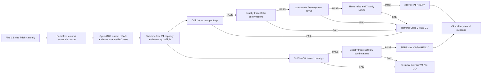

# Prospective Experiments Protocol: XEditCritic V4 and XEditSetFlow V4

> **Frozen status, 2026-08-24.** This document fixes the V4 method, training,
> controls, selection rules, gates, seeds, and claim boundary before any V4
> parameter update or V4 Validation outcome read. It is not a Results section.
> The five already-running C3 screen jobs must finish naturally and remain
> historical Validation evidence; C3 cannot authorize confirmation, TEST,
> refitting, LOSO, or guidance. Development TEST and new final Evaluation outcome
> reads remain zero.

## Why V4 replaces the downstream V3 route

V3 established two method limitations that capacity alone does not resolve. The
Critic screen used singleton physical forwards and a small edit branch, while its
endpoint sharing could still transfer the wrong structure across measurement
semantics. The SetFlow screen achieved low common set-marginal NLL without the
required recovery and diversity, showing that a candidate-union likelihood and
NLL-only checkpoint choice did not align with source-level terminal-set coverage.

V4 therefore makes three critic changes together: a 120–180M trainable capacity
contract, physical batches of at least four with an effective task batch of 32,
and edit-local source/candidate cross-attention with semantic endpoint experts.
It makes two generator changes together: a 80–150M source-conditioned mixture
model and an explicit source-candidate coverage/count objective. Larger capacity
is a means to test these mechanisms; peak memory is an audited preflight property,
not a success metric.

## Evidence barrier and stopping order

No C3 performance result changes this order. C3 remains the historical
Validation reference in the V4 screen threshold, but it never opens TEST. V3
artifacts, controls, checkpoints, and terminal NO-GO decisions are read-only and
are not rerun or overwritten.

## XEditCritic V4 question and architecture

The primary critic question is whether a large, edit-local, endpoint-semantically
partitioned critic improves source-relative ranking beyond the terminal C3
reference, a same-information C0-V4 baseline, candidate-information controls, and
parameter-matched mechanism ablations.

The bottom six blocks of the fixed mRNABERT revision are frozen. TRAIN and
VALIDATION source/candidate chunks cache their block-six per-token states in
float16, along with chunk, mask, special-token, and ragged edit mapping metadata;
the cache contains no raw sequence, label, TEST, or Evaluation outcome. The top
six mRNABERT blocks are trained. The edit trunk has twelve width-768 blocks with
12 heads and FFN width 3072, alternating six unordered edit-set self-attention
blocks with six local cross-attention blocks. Each edit query reads radius-32
source and candidate token neighborhoods through shared attention parameters and
fuses directional delta with symmetric mean. A hidden-65, depth-two raw
antisymmetric CNN and the whole-sequence mean remain residual branches.

Every block retains a shared FFN and four bottleneck-256 semantic residual
experts. A top-two router sees only outcome-free quantity, measurement, ratio,
region, assay, and context descriptors. Study identity cannot enter the router or
shared effect trunk and is restricted to intercept-free multiplicative scale;
the unknown-study scale is exactly one. Source and candidate directions share all
parameters and dropout masks. The final half-difference is strictly
antisymmetric, and identity pairs return exactly zero.

The implementation-bound readout concatenates edit attention pooling, edit max
pooling, the raw antisymmetric residual, global directional delta, global
symmetric mean, and endpoint condition (six 768-wide branches), then applies a
counted `4608→2560→768` fusion. This is the sole large readout and is not an
additional transformer trunk. With a geometry-compatible six-block upper encoder,
the prospectively counted local model contains 173,692,549 trainable parameters;
the formal pretrained instance must reproduce the 165–175M target before training.

The instantiated model must contain 120–180M trainable parameters, targeting
165–175M. Before any outcome or Validation metric read, TRAIN geometry alone is
used to select the largest physical batch in {4, 8, 16, 32} whose in-process peak
allocated A100 memory does not exceed 35 GiB. Physical batches smaller than four
are forbidden; gradient accumulation fixes the effective batch at 32. The
preflight target is 20–35 GiB. Falling outside it pauses the run for prospective
review rather than padding memory, shrinking the model, or falling back to CPU.

The screen seed is 20260907 and the fixed final checkpoint is pass eight. Passes
1–2 optimize Huber plus 0.25 same-task, cross-source-group pairwise loss. Passes
3–8 optimize Huber plus 0.50 pairwise, 0.25 soft-Spearman, and 0.01 router-balance
loss. Soft ranks use pairwise sigmoids at temperature 0.20 and target mid-ranks for
ties. The screen contains C0-V4, V4-FULL, four candidate-information controls,
V4-NO-CROSS, and V4-NO-MOE under identical data, sampler, endpoint information,
passes, updates, and loss schedules.

V4-FULL passes only if its task-macro Spearman is at least

\[
\max\{0.30,\rho_{\mathrm{C3\ ref}}+0.05,
\rho_{\mathrm{C0\text{-}V4}}+0.10\},
\]

while meeting the frozen MAE, task-breadth, candidate-control, six-task
permutation, two-mechanism-ablation, numerical, capacity, memory, and protected-read
conditions. A failed item creates `XEDITCRITIC_V4_SCREEN_NO_GO`. A passing screen
authorizes exactly seeds 20260908, 20260909, and 20260910 with matched C0-V4 runs.
Only a three-of-three confirmation pass can open the one-shot atomic Development
TEST. TEST cannot select an epoch or cause retraining. TEST passage is followed by
fixed eight-pass refits and 7-study LOSO; only their full gate creates
`CRITIC_V4_READY_FOR_GUIDANCE`.

## XEditSetFlow V4 question and architecture

The generator question is whether a source-level mixture model can improve
measured candidate recovery and diversity while retaining comparable set NLL and
all legal `SUB + STOP` trajectory guarantees. It does not use critic scores,
independent-evaluator scores, Development TEST outcomes, or Evaluation outcomes.

The trunk has 18 hybrid blocks, width 640, 10 attention heads, FFN width 2560,
local window 64, dilation cycle 1/2/4/8, and dropout 0.10. Eight source-conditioned
latent modes share the trunk but receive low-rank token residuals and separate
substitution and STOP heads. The mode prior is
\(0.5\operatorname{softmax}(r)+0.5/8\); the selected mode is fixed for the entire
trajectory. A remaining-edit-count head calibrates STOP and budget progression.
The instantiated trainable count must be 80–150M, targeting 95–110M.

Training is organized by source. Duplicate candidate rows collapse to equal-weight
unique terminal edit sets. Each source contributes exactly four states per pass:
empty, two partial subsets drawn from different compatible terminal sets, and a
completed or structurally budget-exhausted state. For each compatible candidate,
the objective assigns probability to its own remaining true edits rather than
only to the union of all positive edits. The frozen loss is common set-marginal
plus 0.50 source-candidate coverage, 0.20 remaining-count calibration, and 0.05
mode information. There is no unconditional entropy bonus.

The screen seed is 20260911. Training always completes ten passes and saves passes
4, 6, 8, and 10. Only after the terminal training summary are the four checkpoints
evaluated on the fixed 891-source cohort, using exactly 32 trajectories per source
and the same decoder streams. Each mode receives one trajectory; the remaining 24
follow the smoothed prior by largest remainder. There are no retries or
duplicate-rejection samples.

A selectable checkpoint must simultaneously achieve common NLL at most 2.06809,
recovery at least 0.35, top-k recovery at least 0.20, unique rate at least 0.90,
and all G0 correctness conditions. Eligible checkpoints are selected by recovery,
then top-k recovery, then lower NLL, then earlier pass. The four-checkpoint NLL
minimum is retained as a read-only diagnostic of selection mismatch. A
non-selectable single-mode control tests the mixture mechanism without unused
parameter padding. V4-FULL must also beat terminal F2 by 0.05 recovery, 0.03 top-k
recovery, and 0.15 unique rate, and beat single-mode by 0.03 recovery and 0.05
unique rate. Otherwise it becomes `XEDITSETFLOW_V4_SCREEN_NO_GO`.

A passing screen authorizes exactly seeds 20260912, 20260913, and 20260914. Every
seed must meet all absolute and terminal-F2 relative gates, with a positive lower
bound for the paired-source bootstrap recovery improvement. Only a three-of-three
pass creates `XEDITSETFLOW_V4_G0_READY`.

## Guidance and claim boundary

Guidance remains blocked until both V4 readiness states exist. The latent mode is
part of the state and remains fixed through a trajectory. Guidance must retain the
single scalar-potential difference

\[
U_q(s,s',t)=U_p(s,s',t)
\exp\{\beta(t)[V_t(s')-V_t(s)]\};
\]

there is no free action-ratio head. The existing 18-cell
\(\kappa\times\tau\times\beta_{\max}\) screen, closed measured-neighborhood,
32-particle SMC, and 320-forward-equivalent matched-compute rules remain fixed,
with base, mode, value, and each critic-member forward charged.

A V4 Development success is not independent external confirmation. A new,
outcome-unexposed, schema-convertible Evaluation may be read once only after the
predictor, generator, baselines, metrics, and adaptation policy are frozen. If
either V4 screen or confirmation fails, the manuscript remains not ready for a
model-advantage claim. Thresholds, controls, tasks, and seeds are not changed; a
future method requires a new user discussion and prospective freeze.

## Implementation evidence note（2026-08-25）

The nine frozen behavior-interface names are now bound to concrete code paths
rather than protocol-only labels. The Critic batch, semantic mixture, and
prediction interfaces are consumed by the formal collator/model/scorer chain;
the SetFlow source batch, per-candidate mixture target, and checkpoint decision
are consumed by the formal collator/model/loss/gate chain. The cache,
trajectory-state, and matched-compute interfaces were already concrete and
remain in use. This note records implementation conformance only and does not
amend any architecture, seed, loss, threshold, gate, outcome-access boundary,
or claim above.

The SetFlow checkpoint validator's required small-graph evidence is now covered
by an executable mechanics test rather than only by a gate-fixture field. The
test runs the validator's mixture aggregation twice: once through exact dynamic
programming and once through independent recursive enumeration of every complete
path. It requires both distributions to normalize and their total variation to
be at most (10^{-12}). Deterministic outcome-free priors and rates make this a
local mechanics test; the formal A100 validation retains real model inference
and its CUDA-only boundary. This adds no performance observation and therefore
does not support a recovery, diversity, NLL, or model-advantage claim.

SetFlow gradient isolation is also bound by an executable test of the formal
training entry point. The only backward source is the frozen mixture SetFlow
objective, whose inputs are the SetFlow output, the source-level target batch,
and the three preregistered component weights. The runner has no critic
prediction, critic reward, independent-evaluator, or outcome dependency in that
graph. This verifies method separation but adds no performance evidence.

The latent-mode regularizer now has an analytic two-mode test. Known router
logits must produce the exact smoothed prior, known candidate-specific action
masses must produce the expected mode posteriors, and the implementation's
mutual-information and aggregate-balance terms must equal the hand-computed KL
expression. This verifies the preregistered objective numerically without
reading a model-selection outcome.

The active Route 2 heartbeat has been migrated from its stale V3-only prompt
and 560-minute interval to the same V4 authority and the frozen 60-minute
cadence for jobs older than four hours. This is execution-governance evidence:
it preserves terminal-only observation, the C3 read-only boundary, protected
outcomes, and the current-HEAD synchronization barrier, but provides no model
performance evidence.

The hourly heartbeat is aligned to local minute 46, immediately after the
current calibrated not-before boundary and every 60 minutes thereafter. Each
run must still perform its own final local-time and remote-offset check; the
wall-clock alignment is not permission to bypass that guard.

The post-screen three-seed comparison now has a concrete fail-closed execution
chain. It materializes the already frozen 97 runtime configurations only after
the unique 18-cell guidance screen is terminal, then schedules exactly the
three preregistered SetFlow seeds, their seed-local value models, all matched
generation and guidance controls, terminal critic scoring, closed and open
metrics, the independent evaluator, equal-wall sensitivity, and the final
paired evidence. The three seed chains must all terminate before the unique
final adjudicator can run. This is implementation and provenance evidence
only: the chain has not been executed, no Validation performance result has
been read, and the model-advantage and submission-readiness claims remain
unestablished.

The frozen bottom-six Critic cache and the read-only SetFlow source-token cache
have both reached terminal success on the frozen V4 experiment head. The
Critic cache covers only the authorized TRAIN/VALIDATION projections, writes
neither raw sequence nor label/outcome payloads, and records zero Development
TEST or Evaluation records. This satisfies the representation prerequisite for
the still-unrun parameter/memory preflight; it is not evidence that the V4
Critic or SetFlow gates will pass.

Execution provenance distinguishes the frozen cache experiment commit from the
later, fully tested runner commit. Cache identity and content remain bound to
the former; the A100 test audit, preflight code, preflight output, and later
training runtime are bound to the latter. Both identities are explicit in the
authorization artifacts. This correction was made before any preflight or
optimizer job and changes no architecture, data, seed, loss, threshold, or
claim.
