# Paper Figure 1: Full-Length Edit-Flow Algorithm

- Claim policy: Figure 1 may describe full-length constrained edit-flow optimization over 5'UTR + CDS + 3'UTR. It must not depict MEF as unconstrained de novo generation, external SOTA reproduction, or wet-lab validated design.
- Ready for algorithm figure draft: `True`; ready for full de novo claim: `False`; ready for wet-lab claim: `False`
- Full-length segments: `["5'UTR", 'CDS', "3'UTR"]`; hard constraints visible: `True`; source files ready: `True`

## Mermaid Source

```mermaid
flowchart LR
    A["Public full-transcript source<br/>Existing mRNA records with 5'UTR + CDS + 3'UTR and CDS coordinates."]
    B["Region and phase annotation<br/>Track nucleotide region, CDS codon phase, source length, motifs, and edit budget."]
    C["CTMC edit bridge<br/>Align source/target transcripts and sample gap-free intermediate edit states."]
    D["Stage A edit-flow generator<br/>Predict insert, substitute, and delete rates under region-aware context."]
    E["Hard-constraint masks<br/>Apply legal sequence checks, CDS synonymous lattice, protein identity, frame, length, motif, and budget gates."]
    F["Candidate pool<br/>Generate constraint-safe local edits from the source transcript."]
    G["Multi-objective ranker / fusion<br/>Rank candidates with TE proxy, CAI/GC, novelty, source-aware recall, and fusion modes."]
    H["T1-T7 evaluation gates<br/>Audit legality, distribution, novelty, protein identity, edit budget, length, motif, and frame."]
    I["Selected constrained local optimization<br/>Report proxy/offline gains only under exact hard constraints and explicit claim boundaries."]
    A -->|parse full-length regions| B
    B -->|align source and target edits| C
    C -->|train edit rates| D
    D -->|decode with masks| E
    E -->|filter invalid edits| F
    F -->|score and fuse objectives| G
    G -->|audit T1-T7| H
    H -->|select reportable candidates| I
    E -->|hard constraints must remain exact-1| H
    classDef constraint fill:#fff7e6,stroke:#d48806,color:#262626
    classDef audit fill:#f6ffed,stroke:#389e0d,color:#262626
    class E constraint
    class H audit
```

## Caption

Figure 1. mRNA-EditFlow represents an existing full-length transcript as 5'UTR + CDS + 3'UTR, samples region-aware CTMC edit trajectories, applies hard constraint masks for CDS protein identity, frame, legality, edit budget, length and motifs, then reranks constraint-safe local edits with multi-objective fusion before T1-T7 audit. The figure supports a constrained local-optimization claim only, not unconstrained de novo SOTA or wet-lab validation.

## Constraint Callouts

| Constraint | Figure language |
|---|---|
| Full-length representation | The editable object is 5'UTR + CDS + 3'UTR, not CDS-only or UTR-only. |
| CDS protein identity | CDS edits are constrained by a synonymous codon lattice and exact protein identity. |
| Frame and legality | Reading frame, start/stop validity, alphabet, and legal transcript checks are hard gates. |
| Edit budget / length / motif | Local edit budget, target length, Kozak/uAUG/polyA, and motif controls are evaluated explicitly. |
| Claim boundary | Outputs are constrained local optimizations from existing sources, not full de novo SOTA or wet-lab validation. |

## Node Ledger

| ID | Label | Role | Detail |
|---|---|---|---|
| A | Public full-transcript source | input | Existing mRNA records with 5'UTR + CDS + 3'UTR and CDS coordinates. |
| B | Region and phase annotation | representation | Track nucleotide region, CDS codon phase, source length, motifs, and edit budget. |
| C | CTMC edit bridge | generator_training | Align source/target transcripts and sample gap-free intermediate edit states. |
| D | Stage A edit-flow generator | generator | Predict insert, substitute, and delete rates under region-aware context. |
| E | Hard-constraint masks | constraint_layer | Apply legal sequence checks, CDS synonymous lattice, protein identity, frame, length, motif, and budget gates. |
| F | Candidate pool | decoding | Generate constraint-safe local edits from the source transcript. |
| G | Multi-objective ranker / fusion | reranking | Rank candidates with TE proxy, CAI/GC, novelty, source-aware recall, and fusion modes. |
| H | T1-T7 evaluation gates | audit | Audit legality, distribution, novelty, protein identity, edit budget, length, motif, and frame. |
| I | Selected constrained local optimization | output | Report proxy/offline gains only under exact hard constraints and explicit claim boundaries. |

## Edge Ledger

| Source | Target | Label |
|---|---|---|
| A | B | parse full-length regions |
| B | C | align source and target edits |
| C | D | train edit rates |
| D | E | decode with masks |
| E | F | filter invalid edits |
| F | G | score and fuse objectives |
| G | H | audit T1-T7 |
| H | I | select reportable candidates |
| E | H | hard constraints must remain exact-1 |
