# Paper Figure 2: Cascade Recall / Precision Division

- Claim policy: Figure 2 may illustrate source-aware recall followed by precision reranking. It must not claim that cascade decoding significantly beats sequential or hard-negative v2 decoding unless the paired TE comparison is significant.
- Ready for cascade figure draft: `True`; cascade TE significant vs sequential: `False`; ready for cascade positive claim: `False`
- Hard-negative v2 direct default: `True`; hard constraints exact-1: `True`; source files ready: `True`

## Mermaid Source

```mermaid
flowchart LR
    A["Full legal candidate pool<br/>54222 candidates over 64 diagnostic records"]
    B["Source-aware recall ranker<br/>oracle-best top-k recall=0.75410; regret=0.03088"]
    C["Recall top-k set<br/>k=64 retains oracle-best fraction=0.80328"]
    D["Precision reranker<br/>full-pool regret=0.02798; cascade regret=0.02788"]
    E["Cascade output audit<br/>vs sequential delta=+0.00092; p=0.09545"]
    F["Hard-negative v2 direct top64<br/>vs sequential delta=+0.00112; p=0.02049"]
    G["Cascade win/loss mining<br/>win_fraction=0.54688; mean_gain=+0.00092"]
    H["Next training target<br/>Improve recall quality or precision ranker; do not simply claim cascade superiority."]
    A -->|score broad candidate pool| B
    B -->|retain high-recall top-k| C
    C -->|rerank for top-1 TE| D
    D -->|audit cascade output| E
    A -->|direct precision baseline| F
    E -->|mine cascade wins/losses| G
    F -->|compare against default| G
    G -->|train next teacher| H
    classDef recall fill:#e6f7ff,stroke:#1677ff,color:#262626
    classDef precision fill:#f9f0ff,stroke:#722ed1,color:#262626
    classDef caution fill:#fff1f0,stroke:#cf1322,color:#262626
    class B,C recall
    class D,F precision
    class E,H caution
```

## Caption

Figure 2. Cascade decoding separates a source-aware recall ranker from a precision reranker: the recall stage retains more oracle-best edits (k64 retained fraction 0.80328), then precision reranking selects a top-1 candidate under hard constraints. The head256 cascade has a positive but non-significant TE trend versus sequential precision (delta +0.00092, paired p 0.09545); hard-negative v2 direct top64 is the current stronger default versus sequential (delta +0.00112, paired p 0.02049).

## Key Diagnostics

| Metric | Value |
|---|---:|
| `previous_ranker_recall` | 0.42623 |
| `sourceaware_recall` | 0.75410 |
| `cascade_recall_k64` | 0.80328 |
| `cascade_vs_seq_delta` | 0.00092 |
| `cascade_vs_seq_p` | 0.09545 |
| `hardneg_vs_seq_delta` | 0.00112 |
| `hardneg_vs_seq_p` | 0.02049 |
| `hardneg_vs_cascade_delta` | 0.00021 |
| `hardneg_vs_cascade_p` | 0.75262 |
| `cascade10k_vs_hardneg_delta` | -0.00048 |
| `cascade10k_vs_hardneg_p` | 0.36632 |
| `win_fraction` | 0.54688 |
| `mean_cascade_gain` | 0.00092 |

## Node Ledger

| ID | Label | Role | Detail |
|---|---|---|---|
| A | Full legal candidate pool | input | 54222 candidates over 64 diagnostic records |
| B | Source-aware recall ranker | recall | oracle-best top-k recall=0.75410; regret=0.03088 |
| C | Recall top-k set | candidate_filter | k=64 retains oracle-best fraction=0.80328 |
| D | Precision reranker | precision | full-pool regret=0.02798; cascade regret=0.02788 |
| E | Cascade output audit | trend_result | vs sequential delta=+0.00092; p=0.09545 |
| F | Hard-negative v2 direct top64 | current_default | vs sequential delta=+0.00112; p=0.02049 |
| G | Cascade win/loss mining | error_analysis | win_fraction=0.54688; mean_gain=+0.00092 |
| H | Next training target | future_work | Improve recall quality or precision ranker; do not simply claim cascade superiority. |

## Edge Ledger

| Source | Target | Label |
|---|---|---|
| A | B | score broad candidate pool |
| B | C | retain high-recall top-k |
| C | D | rerank for top-1 TE |
| D | E | audit cascade output |
| A | F | direct precision baseline |
| E | G | mine cascade wins/losses |
| F | G | compare against default |
| G | H | train next teacher |
