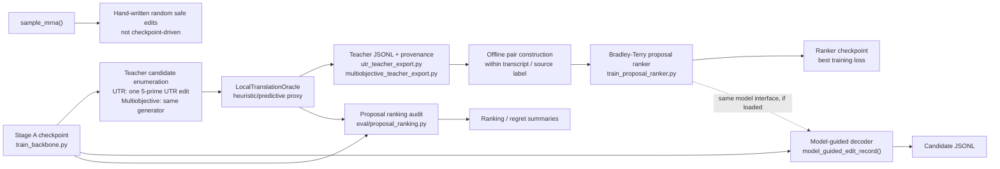

# RL upgrade baseline audit (Stage 0)

Audit date: 2026-07-22
Repository baseline: `Cunyu-Liu/mRNA_editflow`, `main` at `cf08414`, then branch `stage0-rl-baseline-audit`.

## Scope and terminology

This is a code and test-baseline audit only. It makes no performance claim and does not treat a heuristic Oracle output as measured translation efficiency, half-life, or an experimental result.

The current repository contains five distinct mechanisms that must not be conflated:

| Mechanism | Current implementation | Is it online RL over the mRNA policy? |
|---|---|---|
| Stage A | Edit-Flow head training in `train_backbone.py`; produces a checkpoint | No |
| Oracle-guided search | UTR teacher enumeration and optional guided candidate selection | No; deterministic/local proxy scoring over a finite candidate set |
| Offline preference distillation | `train_proposal_ranker.py` fits Bradley-Terry-style pairwise preferences from fixed teacher JSONL | No |
| Model-guided decoding | `model_guided_edit_record()` greedily/stochastically selects grammar-valid proposals from model CTMC intensities | No |
| Random safe editing | `sample_mrna()` applies hand-written safe operators | No; it silently discards supplied `model` and `backbone` |

`rl/grpo.py` does implement group-normalized policy-gradient mechanics for `TinyMDP`, but it is not an end-to-end policy optimizer for the real mRNA Edit-Flow generator. In particular, it is not connected to the Stage A checkpoint, sequence action grammar, production Oracle contract, or an mRNA rollout/update loop.

## Current pipeline



1. Stage A saves a model/backbone checkpoint.
2. `utr_teacher_export.py` enumerates one-step 5-prime UTR substitutions, insertions, and deletions; CDS and 3-prime UTR are copied unchanged. `multiobjective_teacher_export.py` reuses that generator.
3. `LocalTranslationOracle` scores 5-prime UTR features using deterministic regressors or optional local CNN weights. Its TE/MRL outputs are proxies, not experimental measurements.
4. Teacher JSONL stores a scalar `teacher_score` and, for multi-objective export, objective-specific `source_scores`.
5. `train_proposal_ranker.py` computes `log(lambda_op * p_nt)` and minimizes weighted pairwise logistic loss against fixed teacher comparisons. It does not sample new trajectories or update from post-update rollouts.
6. `model_guided_edit_record()` repeatedly recomputes a CTMC field, enumerates legal candidates, and chooses from a top-k local pool. `generate_candidate_records()` writes resulting candidates; `eval/proposal_ranking.py` separately compares one-step model ordering with Oracle ordering.

## Current objective

### Proposal ranker

For a teacher pair `(i, j)`, the student operation score is the **log** intensity:

`s(sub) = log(lambda_sub(pos) * p_sub(nt | pos))`
`s(ins) = log(lambda_ins(pos) * p_ins(nt | pos))`
`s(del) = log(lambda_del(pos))`.

The loss is weighted `softplus(-direction * (s_i - s_j) / temperature)`. Checkpoints are selected solely by lowest observed **training loss** (`best_loss`); no validation ranking metric is computed or used for selection.

### Multi-objective teacher

The objective vector is `{te, mrl, cai, gc, access, uaug}`. `grpo_standardized` z-scores each objective delta inside a finite per-transcript candidate pool and then applies a weighted sum. This is reward/preference fusion, not GRPO: it has no policy ratio/update, no sampling from an mRNA policy, no group of rollouts from a shared state, no reference-policy control in this path, and no post-update data collection.

`TE`, `MRL`, `access`, `GC`, and `uAUG` are partially coupled in the current local Oracle: TE/MRL regressors already include start accessibility, GC-derived terms, and uAUG features. Re-introducing access/GC/uAUG as separate reward components risks double-counting correlated heuristic features. CAI is constant for the current UTR-only teacher because its CDS is copied unchanged.

## Current decoder

`sample_mrna()` is an offline, random-safe compatibility API. It contains `del model, backbone`; passing a model/backbone therefore has no effect. It can optionally rank several hand-written candidates with the local Oracle, but still does not use a checkpoint.

`model_guided_edit_record()` is a separate decoder. It uses **raw** CTMC intensities (`lambda * p`) for candidate ranking, whereas the ranker is trained on their logarithms. The logarithm is order-preserving for strictly positive scores, but it is a train/inference semantic mismatch for scale, margins, temperature behavior, and any later score combination.

There is no explicit STOP/no-op action in the teacher rows, candidate pools, or decoder action space. When the legal candidate pool is non-empty, the model-guided decoder executes one edit per requested budget step; optional Oracle guidance re-ranks proposals but does not compare the best edit against retaining the current record. It can therefore execute an Oracle-negative edit. The random-safe path can likewise mutate up to its budget without a net-benefit acceptance criterion.

## Current hard constraints

The safety-critical path is implemented as hard grammar/filtering, not a reward penalty:

- `core/constants.is_valid_cds()` requires an in-frame CDS, `ATG` start, terminal stop, no internal stop, and no unknown codons.
- `core/mrna_flow_utils.synonymous_nt_sub_mask()` permits only synonymous nucleotide substitutions within complete CDS codons; incomplete CDS boundary positions allow identity only.
- `models/mrna_editformer.py::_apply_codon_constraints()` masks invalid CDS substitution logits and zeroes nucleotide-level CDS insertion/deletion rates (or allows only codon-start whole-codon operators when that option is enabled).
- `sample.py::_synonymous_substitution_candidates()` skips the start and terminal stop codons and checks amino-acid equality; UTR operations are emitted only for selected UTR regions.
- `model_guided_edit_record()` only materializes candidates from those constrained pools. `RegionSpecializedEditFormer` delegates its output heads to the constrained base model, so adapters do not bypass those masks.

These are strong local action constraints. A future online rollout implementation must continue to validate every emitted intermediate and final record, rather than relying only on these logits or a reward term.

## Known semantic mismatches and scientific risks

1. **Not complete GRPO.** `fusion_mode="grpo_standardized"` is only per-candidate-pool z-score reward fusion. The separate TinyMDP GRPO implementation is not a real mRNA training loop.
2. **Teacher locality.** Both teacher exporters use `_one_step_candidates()` over the original record's 5-prime UTR only. They do not aggregate intermediate states or label multi-step trajectories.
3. **Region transfer risk.** The teacher row schema has no explicit editable-region field. The 5-prime UTR teacher is safe while trained/scored against its own source records, but a ranker checkpoint can be supplied to a decoder whose default editable regions are both `utr5` and `utr3`; no provenance-level gate prevents a 5-prime teacher from informing 3-prime UTR decoding.
4. **No abstention.** No STOP/no-op or source-record comparator is included. A requested edit budget can force an unfavorable edit.
5. **Ranking coverage and regret.** `candidate_cap` truncates the proposal pool after sorting by model score and before Oracle evaluation in `eval/proposal_ranking.py`. Reported regret is therefore relative to the capped, model-preselected pool, not necessarily global regret across all legal edits. Teacher caps alternately keep fused-score extremes, also changing the preference distribution.
6. **Proxy dependence.** `LocalTranslationOracle` explicitly consists of heuristic feature regressors/optional locally fit CNN. Its outputs must be described as local predicted/proxy scores only, never as measured TE, MRL, half-life, or experimental validation.
7. **Objective overlap.** TE/MRL feature regressors already encode GC/accessibility/uAUG-related terms; the multi-objective vector may count the same heuristic signal more than once. CAI is degenerate for current UTR-only candidates.
8. **Checkpoint selection.** Stage A and proposal-ranker best checkpoints use training loss, not held-out ranking quality, calibration, regret, or independent biological endpoints.
9. **Intensity-scale mismatch.** Ranker training uses log intensities; decoding/evaluation use raw intensities. Rankings agree only before later score mixing and finite-temperature sampling.

## Existing tests

The relevant suite includes:

- `tests/test_training_sampling.py`: Stage A smoke, checkpoint-guided candidate generation, ranker smoke, safety and sampling behavior.
- `tests/test_region_adapters.py`: identity initialization, regional gating, frozen base, checkpoint compatibility.
- `tests/test_baselines_ablation.py`: UTR teacher locality, multi-objective source scores/Pareto/z-score fusion, cap behavior.
- `tests/test_eval.py`: provenance, paper-mode and Oracle contract fail-closed behavior.
- `tests/test_multi_region_oracle.py`: multi-region Oracle coverage.
- `tests/test_p2_05_grpo.py` and `tests/test_p2_05_grpo_pilot.py`: TinyMDP GRPO mechanics and pilot contract checks, not an end-to-end mRNA policy optimization result.

## Baseline commands

The default `/usr/bin/python3` is missing `pytest`; it failed immediately with `ModuleNotFoundError: No module named 'pytest'`. The server's existing CodeNGPT environment provides pytest 9.1.1. The relevant command is:

```bash
cd /home/cunyuliu/mrna_editflow_goal
PYTHONPATH=/home/cunyuliu/mrna_editflow_goal \
  /home/cunyuliu/mrna_editflow_goal/mrna_editflow/external_tools/envs/codongpt/bin/python \
  -m pytest -q \
  mrna_editflow/tests/test_training_sampling.py \
  mrna_editflow/tests/test_region_adapters.py \
  mrna_editflow/tests/test_baselines_ablation.py \
  mrna_editflow/tests/test_eval.py \
  mrna_editflow/tests/test_multi_region_oracle.py \
  mrna_editflow/tests/test_p2_05_grpo.py \
  mrna_editflow/tests/test_p2_05_grpo_pilot.py
```

### Result (2026-07-22)

`285 passed, 9 failed, 3 warnings in 462.68s (0:07:42)`.

All nine failures are in `tests/test_p2_05_grpo_pilot.py`. Its synthetic `Args` fixture lacks the newly-read `max_steps` attribute, while `scripts/run_p2_05_grpo_pilot.py::build_run_config()` unconditionally accesses `args.max_steps` when constructing `P205RunConfig`. The failures are:

- five `TestBuildRunConfig` cases;
- three `TestRunGrpoPilotMDPNotReady` cases;
- `TestGRPOConfigConstruction::test_grpo_config_includes_kl_and_entropy`.

The test also emitted two PyTorch warnings from `rl/grpo.py` for the empty-group edge case: standard deviation with degrees of freedom at or below zero. No test was weakened and no implementation was changed in Stage 0.

## Baseline artifacts

Existing, untracked server artifacts were inspected but not modified or pushed. Representative reproducibility inputs/outputs include:

- Stage A checkpoints under `ckpts/stage_a_full_a100_max_gencode_100k_seed*/stage_a_best.pt`.
- Proposal-ranker profiles under `logs/proposal_ranker_*.profile.jsonl`.
- Fixed teacher JSONL/summary artifacts under `benchmark/multiobjective_teacher_head{256,1024}/`.
- Proposal/cascade comparisons under `benchmark/compare_*` and multi-seed summaries under `benchmark/multiseed_*`.

These are baseline artifacts, not proof of real biological improvement. Their provenance/split/paper-mode contracts must remain enforced in later stages.

## Concrete Stage 1 change points

1. `baselines/utr_teacher_export.py::_one_step_candidates` and `baselines/multiobjective_teacher_export.py::score_record_multiobjective_rows`: introduce an explicit action/region schema and keep 5-prime/3-prime provenance separate; do not reuse a 5-prime teacher for 3-prime actions without labelled evidence.
2. `train_proposal_ranker.py::train_proposal_ranker` and `_save_ranker_checkpoint`: add held-out, split-verified ranking metrics and choose checkpoints by a documented validation ranking criterion while retaining training-loss logs for compatibility.
3. `sample.py::sample_mrna`: either reject model/backbone arguments or route them explicitly to a checkpoint-driven API; preserve the current random-safe API under a clear name for backward compatibility.
4. `sample.py::model_guided_edit_record` and `eval/proposal_ranking.py::score_record_proposals`: add a legal STOP/no-op candidate and report both capped-pool and full-pool regret.
5. `baselines/multiobjective_teacher_export.py`: rename `grpo_standardized` to a preference-fusion term (with a documented deprecated alias), add correlation/redundancy diagnostics, and do not label it GRPO.
6. New Stage B/C modules should collect fixed-provenance multi-step intermediate states; new Stage D modules must connect constrained mRNA rollouts, group-relative advantages, reference policy/KL, real policy updates, and post-update data aggregation without relaxing CDS grammar.

## Unresolved items

- No independent experimental assay or validated external predictor establishes that the local Oracle scores correspond to real TE, MRL, or half-life.
- No end-to-end constrained online GRPO run exists for the real mRNA generator in this baseline.
- The full legal-pool global regret is unknown whenever a candidate cap/top-k policy is used.
- The P2-05 pilot test fixture and `build_run_config()` contract are out of sync on `max_steps`; resolve this before claiming the pilot contract is covered.
